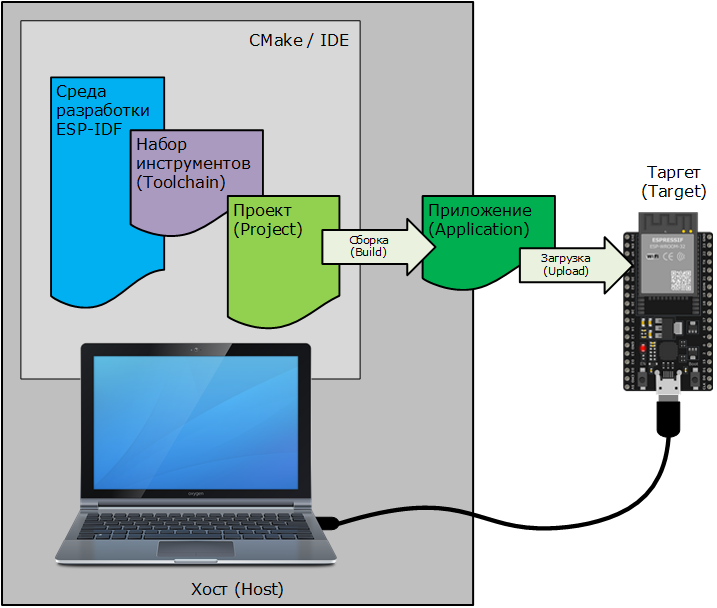
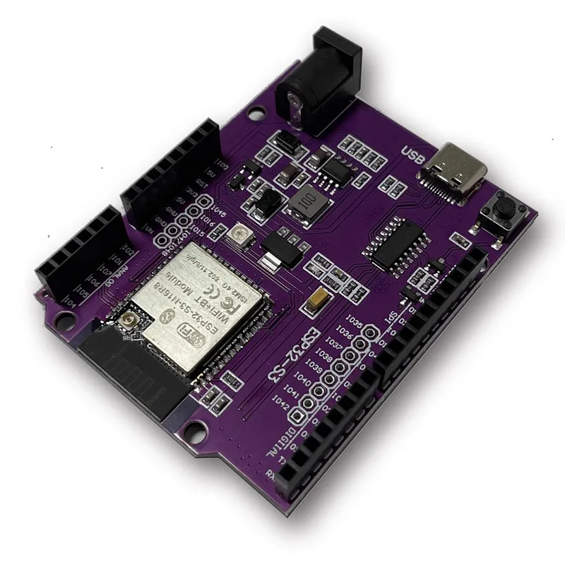
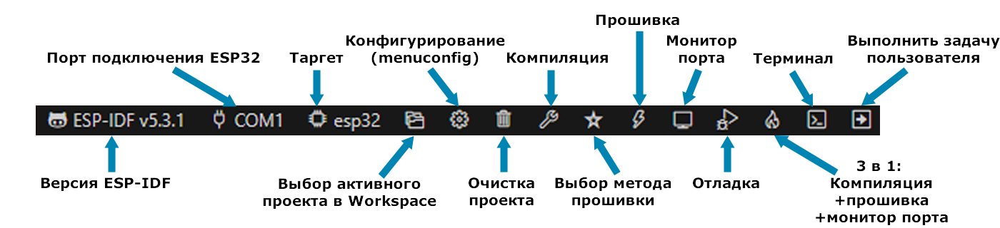
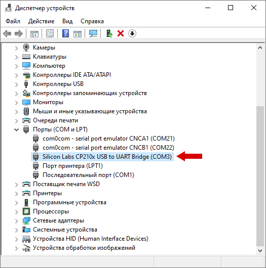

# 1. Лабораторная работа: Знакомство с микроконтроллером - первая програма и интерфейс ввода/вывода общего назначения
## Описание практикума
### Цели работы
Рассмотреть оборудование, которое будет использоваться в дальнейшем, а так же разобрать код простейшей программы.

Все проекты будут выполняться с использованием SoC ESP32.
В качестве IDE будет использоваться VS Code с добавлением расширения ESP-IDF.

Рассмотрим подробнее, что потребуется в этой работе.
Итак, из аппаратного обеспечения нам понадобится:

* плата на базе ESP32;
* кабель USB A / micro USB B (или USB Type-C на некоторых современных платах);
* компьютер под управлением операционной системы Windows, Linux или macOS.

Для успешного написания программы и программирования микроконтроллеров серии ESP32 на хост-компьютере должны быть установлены:

* набор инструментов (toolchain) для компиляции кода для ESP32;
* инструменты сборки – CMake и Ninja для сборки полноценного приложения для ESP32;
* ESP-IDF, который по сути содержит API (библиотеки программного обеспечения и исходный код) для ESP32 и скрипты для работы набора инструментов.
  


### ESP32-S3 for UNO

ESP32-S3 for UNO — это, по сути, ESP32-S3 в форм-факторе Arduino UNO (совместимая по разъёмам). Это важно, так как она совместима со стандартными шилдами Arduino UNO например, Grove Base Shield V2 - который будет задействован в курсе в дальнейшем. Помимо этого плата содержит в себе - Wi-Fi и BLE 5.0, следовательно их не придется подключать отдельными модулями



# 1.1. Начало работы с микроконтроллером
## 1.1.1 Hello World — компиляция и загрузка программы

Порядок установки и создания первой программы:
1. Установите [Visual Studio Code](https://code.visualstudio.com/)
2. В самой IDE программе необходимо установить расширение ESP-IDF. Открываем менеджер расширений, в строке поиска указываем esp-idf, и для найденного расширения нажимаем кнопку Install, а после успешной установки расширения в боковой панели Visual Studio Code появится иконка расширения ESP-IDF, которую и следует нажать.
3. При первом запуске расширения ESP-IDF предлагается установить все необходимые компоненты. Предлагается 3 варианта установки: Express (самый простой, все настройки по умолчанию), Advanced (придётся указать ряд параметров самостоятельно) и Use Existing Setup – использовать существующую установку (что может быть полезно, если, например, уже установлена IDE ESP-IDF или вариант с Eclipse). Воспользуется самым простым вариантом – Espress. Если вдруг в дальнейшем понадобится снова настроить конфигурацию, например, установить другую (хоть новую, хоть старую) версию фреймворка, то сделать это можно в боковом меню Configure ESP-IDF Extension.
4. Выбираем в качестве источника, откуда будут скачиваться и устанавливаться необходимые компоненты, Github, выбираем версию фреймворка - последнюю доступную (текущая 5.5). Если все хорошо, то нажимаем Install и ждём окончания процесса скачивания и установки. Может потребоваться достаточно большой период времени, так как предстоит скачать ~2 Гб.
5. После установки в меню команд выбираем New Project Wizard, указываем имя проекта – например hello_world (пробелы, кириллицу и т.д. не используем!), проверяем, чтобы директория проекта не содержала не-ASCII символов, при необходимости меняем каталог. В поле Choose ESP-IDF Board выбираем Custom board, а в поле OpenOCD Configuration files (Relative paths to OPENOCD_SCRIPTS) пишем - `board/esp32-wrover-kit-3.3v.cfg`. Теперь переходим далее нажимая Choose Template
6. Из предложенных вариантов выбираем template-app - по сути пустой проект.
7. Раскроем дерево проекта, выберем файл main.c и посмотрим его содержимое - каркас пустой программы. Заменим текст файла main.c на следующий код программы:
```c
#include <stdio.h>
#include "freertos/FreeRTOS.h"
#include "freertos/task.h"

void app_main(void)
{
    int i = 0;
    printf("Hello world!\n");
    while (1)
    {
        printf("This program runs since %d seconds.\n", i++); 
        vTaskDelay(1000 / portTICK_PERIOD_MS);
    }
}
```
Программы для встраиваемых устройств работают с момента включения устройства и до его выключения. Поэтому практически всегда такая программа содержит бесконечный цикл, внутри которого и выполняются все операции. Всё что до цикла – это действия, которые нужно выполнить однократно при включении устройства. К примеру, это может быть инициализация необходимых переменных, что и сделано в этом примере. Также однократно выводится текстовое сообщение Hello world! А дальше, в бесконечном цикле, заданном оператором while, осуществляется вывод текстового сообщения, говорящего о том, сколько секунд прошло с момента запуска программы.

Следует также обратить внимание на то, что в цикле используется вызов функции vTaskDelay(). Данная функция формирует задержку выполнение программы на указанное в её аргументе время. В нашем примере это 1000 мс или же 1 с. Функция vTaskDelay() является частью API FreeRTOS, а потому в начале программы подключаются заголовочные файлы FreeRTOS.h и task.h. Константа portTICK_PERIOD_MS задает сколько отсчетов системного таймера (сколько тиков) составляет период в 1 мс.

8. Ознакомимся с панелью инструментов ESP-IDF. В Visual Studio Code она располагается снизу.

9. Запускаем процесс компиляции и сборки проекта. При успешной сборке на вкладке OUTPUT, которая открывается по умолчанию, будет выведено соответствующее сообщение и на некоторое время появится всплывающее окно с сообщением об успешном окончании операции сборки. Также при успешной сборке на вкладке TERMINAL отображается информация о распределении памяти микроконтроллера.
10. Убедиться в работоспособности оборудования и узнать, какой номер порта назначен плате, которую подключили к компьютеру, в ОС Windows можно запустив Диспетчер устройств. На основе этой информации нужно выбрать соответствующий порт в проекте и метод программирования (UART).



11. Программируем микроконтроллер – заливаем прошивку. Информацию об окончании процесса загрузки прошивки (Flash Done) можно увидеть на вкладке OUTPUT и во всплывающем окне. Переходим к монитору последовательного порта, к которому подключена плата – именно через него на вкладке TERMINAL можно наблюдать вывод программы.

Полезные ресурсы:
- [Wokwi](https://wokwi.com/projects/new/esp-idf-esp32) - эмулятор работы микроконтролера и ряда компонентов  
  Залить .bin: F1 -> Upload Firmware and Start Simulation -> выбрать нужный .bin файл 
- [PICSimLab - Prog. IC Simulator Lab.](https://sourceforge.net/projects/picsim/) - офлайн эмулятор  
  Залить .bin: щелкнуть на изображение микроконтроллера -> выбрать нужный .bin файл 

## 1.1.2 Blink — встроенный светодиод
На отладочной плате, входящей в учебный набор, присутствует светодиод, подключенный к порту GPIO2. Для начала будем управлять им. Конечно, это будет классика в мире программирования микроконтроллеров – программа Blink, мигающая светодиодом.

На отладочной плате, входящей в учебный набор, присутствует светодиод, подключенный к порту GPIO2. Для начала будем управлять им. Конечно, это будет классика в мире программирования микроконтроллеров – программа Blink, мигающая светодиодом.
```c
#include "driver/gpio.h"
```
В начале программы нужно сконфигурировать ножку микроконтроллера, к которой подключен светодиод, как выход. Реализуется это при помощи функции gpio_set_direction(). Функция имеет два аргумента: первый аргумент функции – это номер GPIO, второй – режим работы. Возможные режимы работы:
| Режим                     | Описание                      |
|----------------------------|-------------------------------|
| GPIO_MODE_DISABLE          | Отключено                     |
| GPIO_MODE_INPUT            | Вход                          |
| GPIO_MODE_OUTPUT           | Выход                         |
| GPIO_MODE_OUTPUT_OD        | Выход (открытый сток)         |
| GPIO_MODE_INPUT_OUTPUT     | Вход и выход                  |
| GPIO_MODE_INPUT_OUTPUT_OD  | Вход и выход (открытый сток)  |
Очевидно, что в данном случае нужно использовать режим GPIO_MODE_OUTPUT.

Далее в бесконечном цикле меняем состояние ножки GPIO при помощи функции gpio_set_level(). У этой функции тоже два аргумента: первый аргумент – номер GPIO, второй – состояние выхода (0 – низкий, 1 – высокий). Как и в случае с Hello World, период выполнения циклических действий задается функцией vTaskDelay().

Окончательный листинг нашего приложения будет следующий.
```c
#include <stdio.h>
#include "freertos/FreeRTOS.h"
#include "freertos/task.h"
#include "driver/gpio.h"

#define LED GPIO_NUM_2

void app_main(void)
{
  gpio_set_direction(LED, GPIO_MODE_OUTPUT);
  uint32_t led_on = 0;
  while (true)
  {
    led_on = !led_on;
    gpio_set_level(LED, led_on);
    vTaskDelay(1000 / portTICK_PERIOD_MS);
  }
}
```
> [!WARNING]  
> На плате esp32s3 uno нет встроенного простого светодиода, поэтому для этого примера предлагается воспользоваться внешним светодиодом.

<details>
  <summary>Однако на плате присутствует адресный RGB светодиод, которым можно тоже поуправлять</summary>

ESP32-S3 UNO оснащен WS2812 — адресным RGB светодиодом, взаимодействовать с которым можно через библиотеку `led_strip`.  

Подключить библиотеки можно, изменив файл `CMakeLists.txt`, прописав библиотеку в строке `REQUIRES`:  

```cmake
idf_component_register(SRCS "main.c"
                        INCLUDE_DIRS "."
                        REQUIRES driver led_strip)
```
Программа для управления диодом:

```c
#include "freertos/FreeRTOS.h"
#include "freertos/task.h"
#include "led_strip.h"
#include "driver/rmt_tx.h"

#define LED_GPIO 48 // GPIO для WS2812

void app_main(void)
{
    led_strip_handle_t strip;

    ESP_ERROR_CHECK(led_strip_new_rmt_device(
        &(led_strip_config_t){.max_leds = 1, .strip_gpio_num = LED_GPIO, .led_model = LED_MODEL_WS2812},
        &(led_strip_rmt_config_t){
            .clk_src = RMT_CLK_SRC_DEFAULT,
            .resolution_hz = 0,
            .mem_block_symbols = 0,
            .flags = {.with_dma = 0}
        },
        &strip
    ));

    while (1) {
        ESP_ERROR_CHECK(led_strip_set_pixel(strip, 0, 5, 0, 0));
        ESP_ERROR_CHECK(led_strip_refresh(strip));
        vTaskDelay(pdMS_TO_TICKS(1000));

        ESP_ERROR_CHECK(led_strip_set_pixel(strip, 0, 0, 0, 5));
        ESP_ERROR_CHECK(led_strip_refresh(strip));
        vTaskDelay(pdMS_TO_TICKS(1000));
    }
}

```
</details>


> [!TIP]
> **Задание для самостоятельной реализации**  
> Сравните приведенный пример с первой программой `Hello World` и добавьте вывод сообщений в консоль на каждой итерации цикла, сообщающих текущее состояние светодиода.
