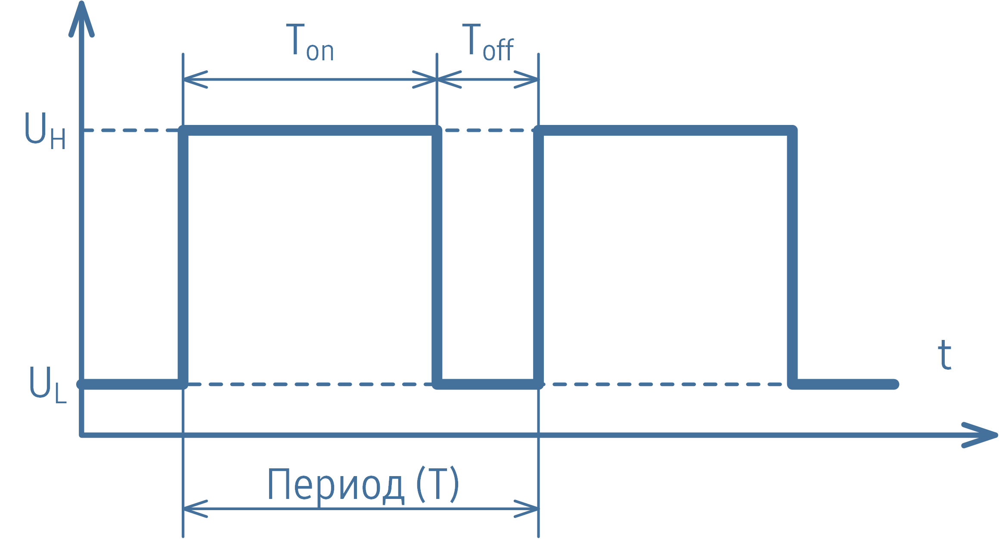
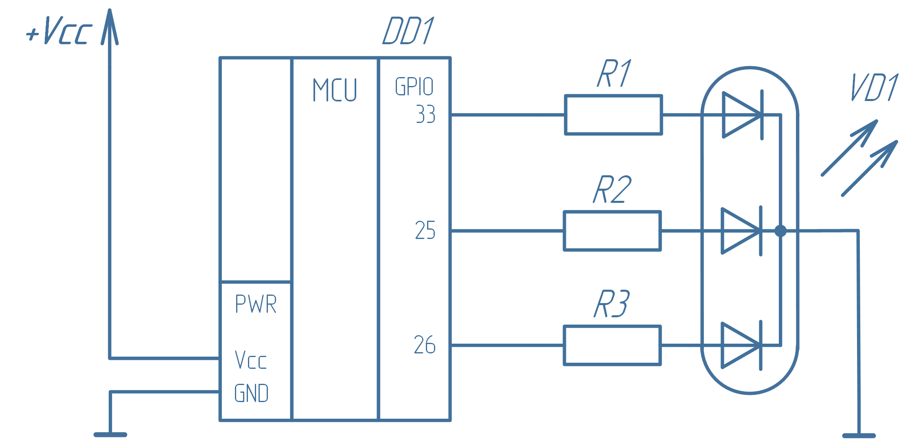
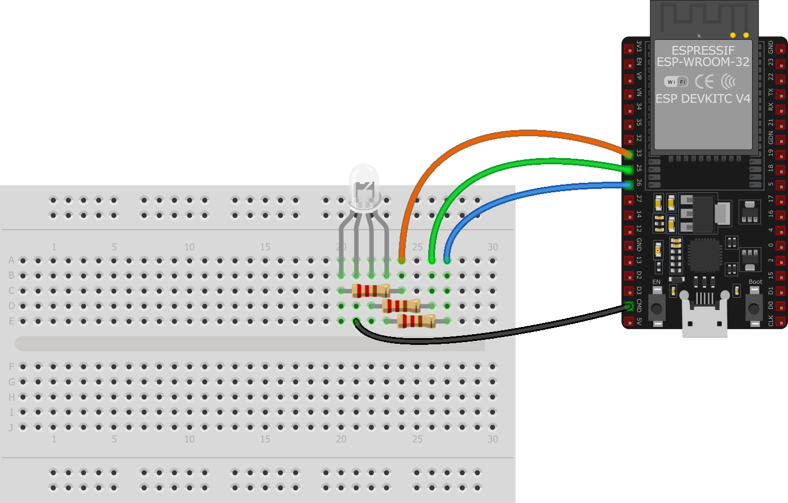

# 1.2 Лабораторная работа: входы и выходы микроконтроллера
## 1.2.1 Управление внешними светодиодами
### Цели работы
Научиться подключать модули (светодиоды: светофор - 3 светодиода и rgb светодиод) к плате ESP32. Научиться работать с ШИМ.

### 1.2.1.1. Светофор

В некоторых случаях одного светодиода на плате может оказаться мало. Допустим, мы хотим реализовать простой индикатор, имитирующий цвета светофора:  

- **Зелёный** – всё в порядке.  
- **Жёлтый** – какой-то параметр (например, измеряемая температура) приблизился к критическому значению и нужно предпринять шаги по нейтрализации надвигающейся угрозы.  
- **Красный** – критическая ситуация, требующая немедленного реагирования.  

В этом случае понадобится **три порта GPIO**, работающих на выход, к каждому из которых будет подключен светодиод.  

> ⚠️ Каждый светодиод должен подключаться через **токоограничивающий резистор**.  
> Необходимо учитывать максимальный ток выхода GPIO. Для большинства микроконтроллеров типовое максимальное значение тока составляет 20 мА (у ESP32 реальное значение выше).  
> Ток светодиода (`Iled`) обычно находится в диапазоне 2…20 мА.  

---

## Расчёт резистора для светодиода

Используем закон Ома:

R = (Uпит - Uled) / Iled
Где:  
- `Uпит = 3.3 В` — напряжение питания микроконтроллера  
- `Uled = 1.8…2.2 В` — прямое падение напряжения на светодиоде (берём среднее 2 В)  
- `Iled` — ток светодиода  

### Минимальное и максимальное сопротивление

- Для тока 20 мА:
  Rmin = (3.3 - 2.0) / 0.020 ≈ 65 Ом

- Для тока 2 мА:
  Rmax = (3.3 - 2.0) / 0.002 ≈ 650 Ом
  
Таким образом можем выбрать любое значение резисторов из диапазона 65…650 Ом. 
**Принципиальная схема**

**Размещение на макетной плате**


Если же мы используем какой-либо модуль, то они уже содержат токоограничивающий резистор (и дополнительный транзисторный ключ), так что их можно подключать напрямую. Для нашей задачи это могло бы выглядеть так.


Каждый порт GPIO, подключенный к светодиодам, можно было бы настроить (как в предыдущей программе) по-отдельности функцией gpio_set_direction(), но сделаем на этот раз по-другому. API ESP-IDF содержит функцию gpio_config(), которой нужно передать заполненную структуру gpio_config_t, в которой и укажем нужные порты GPIO и направление их работы.

Сама структура описана в файле driver\gpio.h следующим образом:
```c
typedef struct {
    uint64_t pin_bit_mask;
    gpio_mode_t mode;
    gpio_pullup_t pull_up_en;
    gpio_pulldown_t pull_down_en;
    gpio_int_type_t intr_type;
} gpio_config_t;
```
В этой структуре:
- `pin_bit_mask` – маска конфигурируемых портов GPIO  
- `mode` – режим работы (аналогично аргументу функции `gpio_set_direction()`)  
- `pull_up_en` – включение подтяжки Pull-Up  
- `pull_down_en` – включение подтяжки Pull-Down  
- `intr_type` – управление прерываниями

Программа, в которой будем управлять несколькими светодиодами будет следующая:

```c
#include <stdio.h>
#include "freertos/FreeRTOS.h"
#include "freertos/task.h"
#include "driver/gpio.h"

// пины подключения светодиодов
#define     LED_RED     33
#define     LED_YELLOW  25
#define     LED_GREEN   26
#define     GPIO_PINS   ((1ULL << LED_RED) | (1ULL << LED_YELLOW) | (1ULL << LED_GREEN))

void app_main(void)
{
    // объявление структуры конфигурации
    gpio_config_t io_conf = {};

    // задание необходимых свойств
    io_conf.pin_bit_mask = GPIO_PINS;             // порты
    io_conf.mode = GPIO_MODE_OUTPUT;              // режим работы - выход
    io_conf.pull_up_en = GPIO_PULLUP_DISABLE;     // нет подтягивающего резистора
    io_conf.pull_down_en = GPIO_PULLDOWN_DISABLE; // нет стягивающего резистора
    io_conf.intr_type = GPIO_INTR_DISABLE;        // прерывания отключены

    // установка конфигурации портов
    gpio_config(&io_conf);

    // счетчик итераций
    uint8_t ticks = 0;

    while (1)
    {
        switch(++ticks % 8)
        {
            case 0:
                gpio_set_level(LED_RED, 0);
                gpio_set_level(LED_YELLOW, 0);
                gpio_set_level(LED_GREEN, 0);
                break;
            case 1:
                gpio_set_level(LED_RED, 1);
                break;
            case 2:
                gpio_set_level(LED_YELLOW, 1);
                break;
            case 3:
                gpio_set_level(LED_RED, 0);
                break;
            case 4:
                gpio_set_level(LED_GREEN, 1);
                break;
            case 5:
                gpio_set_level(LED_YELLOW, 0);
                break;
            case 6:
                gpio_set_level(LED_RED, 1);
                break;
            case 7:
                gpio_set_level(LED_GREEN, 0);
                break;
        }
        vTaskDelay(200 / portTICK_PERIOD_MS);
    }
}
```
> [!TIP]
> **Задания**
>
> 1. Измените схему подключения и код программы так, чтобы они соответствовали вашему подключению модуля к плате.
> 2. В представленной программе один из светодиодов мигает не так, как остальные.  
>    Устраните это нарушение или реализуйте переключение по типу светофора.

### 1.2.1.2. Радуга
Прежде, чем приступать к "Радуге", разберем **ШИМ**

Широтно-импульсная модуляция, сокращенно ШИМ (англ. Pulse Width Modulation, PWM), является одним из наиболее распространенных методов управления мощностью в электронных системах. Этот метод позволяет регулировать мощность, подаваемую на нагрузку, путем изменения ширины импульсов постоянного тока. Широко используется в различных областях электроники, таких как управление двигателями, источники питания, освещение и многие другие устройства.

Основой принципа работы ШИМ является изменение длительности импульсов при постоянной частоте следования этих импульсов. Импульсы представляют собой прямоугольные волны, у которых длительность высокого уровня (включенного состояния) варьируется относительно общего периода сигнала.

ШИМ имеет три основных параметра: частоту, период и коэффициент заполнения. Частота ШИМ (измеряется в герцах) – это число раз, когда ШИМ-сигнал переходит с высокого уровня на низкий и обратно в течение одной секунды. Период ШИМ является величиной, обратной частоте ШИМ. 


Соотношение времени включения (`Ton`) к общему периоду (`T`), выраженное в процентах, называется **коэффициентом заполнения (Duty Cycle)** и может варьироваться от 0% до 100%:

D = (Ton / T) * 100%

В электронике для прямоугольных импульсов с переменной шириной чаще употребляется величина, обратная коэффициенту заполнения, называемая **скважностью**

S = T / Ton

Соответственно, коэффициент заполнения 50 % эквивалентен скважности, равной 2, 100 % – скважности, равной единице, а 0 % равносилен скважности, равной бесконечности (что имеет вполне логичную физическую интерпретацию, как полное отсутствие импульсов).

Если использовать ШИМ для управления светодиодом, то при низкой частоте ШИМ, например 0,5 Гц и коэффициенте заполнения 50 % (светодиод включается на 1 секунду, а затем выключается на 1 секунду) светодиод будет мигать. При увеличении частоты (уменьшении периода) будет достигнут критический порог, при котором человеческий глаз не сможет воспринимать мигание светодиода и будет казаться, что он горит в половину своей максимальной яркости. При изменении коэффициента заполнения будет меняться и яркость, так как будет меняться среднее напряжение, подводимое к светодиоду.

Среднее напряжение напрямую связано с коэффициентом заполнения ШИМ

Uсредн = UH * (D / 100%) + UL * (1 - D / 100%)
Где:  
- `UH` — напряжение в состоянии «включено»  
- `UL` — напряжение в состоянии «выключено»  
- `D` — коэффициент заполнения (%)
В ESP32 есть два периферийных устройства ШИМ: светодиодный ШИМ-контроллер (LEDC – LED Controller) и периферийное устройство управления двигателями на основе широтно-импульсной модуляции (MCPWM).

Основная цель светодиодного ШИМ-контроллера (как не трудно догадаться из названия) – управление яркостью светодиодов, хотя его также можно использовать для генерации ШИМ-сигналов и для других целей, например, для генерации звука. 

В ESP32 LEDC имеет две группы каналов (по 8 в каждой). Одна группа каналов работает в высокоскоростном режиме (high speed mode) и реализуется аппаратно. В этой группе каналов возможно автоматическое и постепенное увеличение или уменьшение скважности ШИМ, что позволяет управлять освещением без непосредственного задействования процессора. Другая группа каналов работает в низкоскоростном режиме (low speed mode). В этом режиме скважность ШИМ меняется программным драйвером. Каждая группа каналов может использовать разные источники тактирования ШИМ.

Настройка любого канала LEDC (как в высокоскоростном, так и низкоскоростном режиме) включает три шага:

1. Настройка таймера, путем указания частоты ШИМ-сигнала и разрешающей способности изменения его скважности.
2. Настройка канала путем связывания его с таймером и ножкой GPIO, на которую выводится ШИМ-сигнал. 
3. Настройка выходного сигнала ШИМ.

Настройка таймера осуществляется посредством вызова функции ledc_timer_config(), в которую необходимо передать заполненную структуру ledc_timer_config_t со следующими параметрами:

 - скоростной режим;
 - номер таймера;
 - источник тактирования;
 - частота ШИМ;
 - разрешающая способность коэффициента заполнения ШИМ.

Частота и разрешающая способность коэффициента заполнения ШИМ взаимозависимы. Чем выше частота ШИМ 𝑓𝑃𝑊𝑀, тем ниже доступное разрешение длительности рабочего цикла 𝑃𝑊𝑀_𝑟𝑒𝑠𝑜𝑙𝑢𝑡𝑖𝑜𝑛, и наоборот. Источник тактового сигнала также может ограничивать частоту ШИМ, и чем больше исходная частота тактового сигнала 𝑓𝑐𝑙𝑜𝑐𝑘, тем выше может быть задана максимальная частота ШИМ (в ESP32 максимальная частота тактовых импульсов может быть настроена на 80 МГц)

𝑓𝑃𝑊𝑀×2𝑃𝑊𝑀_𝑟𝑒𝑠𝑜𝑙𝑢𝑡𝑖𝑜𝑛≤𝑓𝑐𝑙𝑜𝑐𝑘
Где:  
- `fPWM` — частота ШИМ  
- `PWM_resolution` — разрядность коэффициента заполнения  
- `fclock` — частота тактового сигнала

После настройки таймера необходимо настроить требуемый канал, вызвав функцию `ledc_channel_config()`, в которую необходимо передать структуру `ledc_channel_config_t` с параметрами конфигурации канала. После этого канал начнет работать в соответствии с параметрами этой структуры и генерировать ШИМ-сигналы на выбранном GPIO с частотой, указанной при конфигурировании таймера, и коэффициентом заполнения, указанным при вызове этой функции.

Формирования ШИМ-сигнала можно приостановить в любое время, вызвав функцию `ledc_stop()`.

Изменить параметры ШИМ-сигнала можно несколькими способами. Во-первых, это вызов всё той же функции `ledc_channel_config()` с новыми параметрами канала. Во-вторых, так как LEDC предназначен всё же для диммирования светодиодов, можно просто изменять коэффициент заполнения для настроенного канала.

Чтобы задать коэффициент заполнения используется функция `ledc_set_duty()`, но чтобы изменения вступили в силу необходимо после этого вызвать `ledc_update_duty()`. Кстати, текущее значение коэффициента заполнения можно получить функцией `ledc_get_duty()`.

> ⚠️ Важная информация
> Коэффициент заполнения, передаваемый функциям `ledc_set_duty()` и `ledc_update_duty()`, зависит от заданной **разрешающей способности** `duty_resolution`.  
> Его значение находится в диапазоне от `0` до `2^duty_resolution - 1`.  
> Например, если `duty_resolution = 10`, то возможные значения рабочего цикла будут от `0` до `1023`.  
> Если несколько каналов используют один и тот же таймер, **частота ШИМ и разрешающая способность** (число бит) этих каналов будут одинаковыми.

Для начала рассмотрим простую программу, работающую с широтно-импульсной модуляцией. Ниже приведен пример (похожий на тот, что есть среди примеров ESP-IDF).
Используя приведённый код получите "светодиодную мигалку", как в программе Blink.
```c
#include <stdio.h>
#include "driver/ledc.h"
#include "esp_err.h"

#define LEDC_TIMER              LEDC_TIMER_0 // Используем таймер 0
#define LEDC_MODE               LEDC_LOW_SPEED_MODE
#define LEDC_OUTPUT_GPIO        GPIO_NUM_2 // Задаем GPIO - встроенный светодиод на плате
#define LEDC_CHANNEL            LEDC_CHANNEL_0 // Используем канал 0
#define LEDC_DUTY_RES           LEDC_TIMER_13_BIT // Разрешение таймера для коэф. заполнения (13 бит)
#define LEDC_DUTY               4096 // Коэффициент заполнения 50%. (2 ** 13) * 50% = 4096
#define LEDC_FREQUENCY          4000 // Частота ШИМ в Гц (4 кГц)

void app_main(void)
{
    // Конфигурируем таймер
    ledc_timer_config_t ledc_timer = {
        .speed_mode       = LEDC_MODE,
        .duty_resolution  = LEDC_DUTY_RES,
        .timer_num        = LEDC_TIMER,
        .freq_hz          = LEDC_FREQUENCY,
        .clk_cfg          = LEDC_AUTO_CLK
    };
    ESP_ERROR_CHECK(ledc_timer_config(&ledc_timer));

    // Настраиваем канал ЩИМ LED-контролера
    ledc_channel_config_t ledc_channel = {
        .speed_mode     = LEDC_MODE,
        .channel        = LEDC_CHANNEL,
        .timer_sel      = LEDC_TIMER,
        .intr_type      = LEDC_INTR_DISABLE,
        .gpio_num       = LEDC_OUTPUT_GPIO,
        .duty           = 0, // Коэффициент заполнения 0%
        .hpoint         = 0
    };
    ESP_ERROR_CHECK(ledc_channel_config(&ledc_channel));

    // Задаем коэффициент заполнения
    ESP_ERROR_CHECK(ledc_set_duty(LEDC_MODE, LEDC_CHANNEL, LEDC_DUTY));
    // Применяем новые значение к выполнению
    ESP_ERROR_CHECK(ledc_update_duty(LEDC_MODE, LEDC_CHANNEL));
}
```
> ⚠️ Обратите внимание
> В представленном листинге используется полезный приём – макрос `ESP_ERROR_CHECK()`!  
> 
> Во время работы программы важно контролировать, не возникли ли ошибки при вызове системных функций. Если какая-то ошибка произошла, дальнейшее выполнение программы может быть невозможно.  
> 
> Макрос `ESP_ERROR_CHECK()` проверяет своё значение (типа `esp_err_t`).  
> - Если аргумент не равен `ESP_OK`, в консоль выводится сообщение об ошибке.  
> - Затем вызывается системная функция `abort()`, которая завершает работу приложения.

**Управляемый ШИМ**
Теперь рассмотрим другой пример работы со светодиодным контроллером ШИМ в ESP32. В частности, в этом примере демонстрируется работа с функциями:  

- `ledc_get_duty()` – получение текущего коэффициента заполнения (Duty Cycle) для заданного канала  
- `ledc_get_freq()` – получение частоты ШИМ для канала
```c
#include <stdio.h>
#include "freertos/FreeRTOS.h"
#include "freertos/task.h"
#include "driver/ledc.h"
#include "esp_err.h"

#define LEDC_TIMER              LEDC_TIMER_0
#define LEDC_MODE               LEDC_LOW_SPEED_MODE
#define LEDC_OUTPUT_IO          GPIO_NUM_2
#define LEDC_CHANNEL            LEDC_CHANNEL_0

#define LEDC_DUTY_RES           LEDC_TIMER_14_BIT // Set duty resolution to 14 bits

void help_print(void)
{
    printf("Control of LED dimmer by host terminal\n\r");
    printf("press '+' or '-' for change duty time\n\r");
    printf("press '<' or '>' for change frequency\n\r");
    printf("press 'i' or 'I' for info about current mode\n\r");
}

void app_main(void)
{
    // Prepare and then apply the LEDC PWM timer configuration
    ledc_timer_config_t ledc_timer = {
        .speed_mode       = LEDC_MODE,
        .timer_num        = LEDC_TIMER,
        .duty_resolution  = LEDC_DUTY_RES,
        .freq_hz          = 1000,  // Set output frequency at 4 kHz
        .clk_cfg          = LEDC_AUTO_CLK
    };
    ESP_ERROR_CHECK(ledc_timer_config(&ledc_timer));

    // Prepare and then apply the LEDC PWM channel configuration
    ledc_channel_config_t ledc_channel = {
        .speed_mode     = LEDC_MODE,
        .channel        = LEDC_CHANNEL,
        .timer_sel      = LEDC_TIMER,
        .intr_type      = LEDC_INTR_DISABLE,
        .gpio_num       = LEDC_OUTPUT_IO,
        .duty           = 0, // Set duty to 0%
        .hpoint         = 0
    };
    ESP_ERROR_CHECK(ledc_channel_config(&ledc_channel));

    float brightness = 0.5;
    const float brightness_step = 0.05f;
    const uint32_t freq[] = {5, 10, 25, 30, 35, 40, 50, 75, 100, 250, 500, 1000, 4000}; // Hz

    int f_length = sizeof(freq) / sizeof(freq[0]);
    int f_ind = f_length - 1;
    
    help_print();
    printf("Frequency = %ld, Duty = %1.2f\n\r", freq[f_ind], brightness);

    uint32_t duty = (1UL << LEDC_DUTY_RES) * brightness;
    ESP_ERROR_CHECK(ledc_set_duty(LEDC_MODE, LEDC_CHANNEL, duty));
    ESP_ERROR_CHECK(ledc_update_duty(LEDC_MODE, LEDC_CHANNEL));

    while(1)
    {
        char c = getchar();
        switch (c)
        {
            case '+':
                brightness += brightness_step;
                break;
            case '-':
                brightness -= brightness_step;
                break;
            case '<':
                f_ind--;
                break;
            case '>':
                f_ind++;
                break;
        }
        if (brightness > 1.0f)
            brightness = 1.0f;
        if (brightness < 0.0f)
            brightness = 0.0f;
        if(f_ind >= f_length)
            f_ind = 0;
        if(f_ind < 0)
            f_ind = f_length - 1;

        switch (c)
        {
            case '+':
            case '-':
                printf("Duty = %1.2f\n\r", brightness);
                duty = (1UL << LEDC_DUTY_RES) * brightness;
                ESP_ERROR_CHECK(ledc_set_duty(LEDC_MODE, LEDC_CHANNEL, duty));
                ESP_ERROR_CHECK(ledc_update_duty(LEDC_MODE, LEDC_CHANNEL));
                break;
            case '<':
            case '>':
                printf("Frequency = %ld\n\r", freq[f_ind]);
                ESP_ERROR_CHECK(ledc_set_freq (LEDC_MODE, LEDC_TIMER, freq[f_ind]));
                break;
            case 'i':
            case 'I':
                printf("Frequency = %ld, Duty = %1.2f\n\r", freq[f_ind], brightness);
                break;
            case 'h':
            case 'H':
                help_print();
                break;
            case 'd':
            case 'D':
                printf("LEDC Duty = %ld\n\r", ledc_get_duty(LEDC_MODE, LEDC_CHANNEL)); 
                break;
            case 'f':
            case 'F':
                printf("LEDC Frequency = %ld\n\r", ledc_get_freq(LEDC_MODE, LEDC_CHANNEL)); 
                break;
        }
        vTaskDelay(10 / portTICK_PERIOD_MS);
    }
}
```
Светодиод на плате должен светиться, а в консоль выводится информация о текущем режиме работы.  

- Клавиши `+` и `-` на клавиатуре управляют **яркостью** свечения светодиода.  
- Клавиши `<` и `>` позволяют изменять **частоту ШИМ**.  

> [!TIP]
> **Задания**
>
> 1. Поэкспериментируйте с различными вариантами частоты ШИМ.  
> 2. Оцените, насколько регулирование яркости свечения светодиода комфортно для человеческого глаза (проверьте, незаметно ли мерцание).

**Радуга**
Светодиодный контроллер ШИМ ESP32 в высокоскоростном режиме  позволяем автоматически постепенно увеличивать или уменьшать скважности ШИМ без задействования процессора. Рассмотрим как можно сделать это в  в рамках следующего небольшого практикума. 

Будем использовать RGB-светодиод, по сути содержащий в едином корпусе сразу три светодиода, только один обеспечивает формирование красного (R – Red) цвета свечения, второй – зелёного (G – Green), а третий – синего (B – Blue). Путём смешения этих трёх цветов можно получить любой цвет. Обычный RGB-светодиод имеет 4 вывода. Такие светодиоды могут иметь общий анод или общий катод. Именно RGB-светодид с общим катодом показан на рисунке ниже.

В нашем учебном наборе присутствует RGB-светодиод в виде модуля, который можно подключать напрямую, как было со Свнтоформ. Подключим его к отладочной плате и заставим переливаться цветами радуги. Схема подключения RGB-светодиода к ESP32 будет не очень сложной.

С применением макетной платы это могло бы выглядеть так.

На самом деле радуга имеет множество цветов, а 7 цветов были придуманы только потому, что эти цвета наиболее устойчиво воспринимаются и определяются глазом, и мы можем их вспомнить и назвать их благодаря мнемонической фразе: «Каждый Охотник Желает Знать, Где Сидит Фазан». Список этих 7 основных цветов радуги с разложением по компонентам R, G и B представлен в таблице далее.
| Цвет        | R   | G   | B   |
|------------|-----|-----|-----|
| Красный     | 255 | 0   | 0   |
| Оранжевый   | 255 | 127 | 0   |
| Желтый      | 255 | 255 | 0   |
| Зелёный     | 0   | 255 | 0   |
| Голубой     | 0   | 255 | 255 |
| Синий       | 0   | 0   | 255 |
| Фиолетовый  | 255 | 0   | 255 |
Алгоритм работы программы будет весьма простым.

1. Примем за начальную точку отсчета красный цвет (255, 0, 0).
2. Будем постепенно увеличивать значение зелёной составляющей G, пока не достигнем значения оранжевого (255, 127, 0).
3. Продолжим увеличивать значение зелёной составляющей до достижения жёлтого цвета (255, 255, 0).
4. Постепенно уменьшаем значение красной составляющей R до нуля и получаем значения зеленого цвета (0, 255, 0).
5. Постепенно увеличиваем значение синей составляющей B до значения голубого цвета (0, 255, 255).
6. Постепенно уменьшаем зелёную составляющую G до нуля и формирования значения синего цвета (0, 0, 255).
7. Постепенно увеличиваем красную составляющую R до значения фиолетового цвета (255, 0, 255).
8. Постепенно уменьшаем синию составляющую B до получения красного цвета (255, 0, 0).
9. Переходим к шагу 2.

В программе создадим три высокоскоростных ШИМ-канала. Поскольку управлять всеми компонентами цвета мы будем одновременно, имеет смысл использовать один единственный аппаратный таймер для всех трёх каналов.

Для реализации выше представленного алгоритма воспроизведём в программе цифровой автомат, где отдельные его состояния будут соответствовать формированию очередного цвета. Трансформацию цвета будем осуществлять за одну секунду.

Для того, чтобы светодиодный контроллер LEDC мог постепенно изменять скважность, нужно активировать эту возможность функцией `ledc_fade_func_install()`. Новые параметры свечения светодиодов задаются вызовом одной из функций `ledc_set_fade_with_time()`, `ledc_set_fade_with_step()` или `ledc_set_fade()`, а чтобы внесённые изменения вступили в силу, нужно вызвать функцию `ledc_fade_start()`. Работа этой функции может происходить либо в блокирующем, либо в неблокирующем режиме. Мы будем использовать блокирующий режим, и по окончании всех метаморфоз с установлением цвета переходить к формированию нового.

```c
#include <stdio.h>
#include "freertos/FreeRTOS.h"
#include "freertos/task.h"
#include "driver/ledc.h"
#include "esp_err.h"

#define LEDC_TIMER          LEDC_TIMER_0
#define LEDC_MODE           LEDC_HIGH_SPEED_MODE
#define LEDC_GPIO_R         GPIO_NUM_33
#define LEDC_CHANNEL_R      LEDC_CHANNEL_0
#define LEDC_GPIO_G         GPIO_NUM_25
#define LEDC_CHANNEL_G      LEDC_CHANNEL_1
#define LEDC_GPIO_B         GPIO_NUM_26
#define LEDC_CHANNEL_B      LEDC_CHANNEL_2

#define LEDC_DUTY_RES       LEDC_TIMER_13_BIT
#define LEDC_FADE_TIME      1000

// Переобразование R, G или B каналов в коэффициент заполнения с учетом разрешающей способности
#define RGB_TO_DUTY(x)  ((x) * (1 << LEDC_DUTY_RES) / 255)

void app_main(void)
{
    ledc_timer_config_t ledc_timer = {
        .duty_resolution = LEDC_DUTY_RES,
        .freq_hz = 4000,
        .speed_mode = LEDC_MODE,
        .timer_num = LEDC_TIMER,
        .clk_cfg = LEDC_AUTO_CLK,
    };
    ledc_timer_config(&ledc_timer);

    ledc_channel_config_t ledc_channel_r = {
        .channel    = LEDC_CHANNEL_R,
        .duty       = 0,
        .gpio_num   = LEDC_GPIO_R,
        .speed_mode = LEDC_MODE,
        .hpoint     = 0,
        .timer_sel  = LEDC_TIMER,
        .flags.output_invert = 0
    };
    ledc_channel_config_t ledc_channel_g = {
            .channel    = LEDC_CHANNEL_G,
            .duty       = 0,
            .gpio_num   = LEDC_GPIO_G,
            .speed_mode = LEDC_MODE,
            .hpoint     = 0,
            .timer_sel  = LEDC_TIMER,
            .flags.output_invert = 0
    };
    ledc_channel_config_t ledc_channel_b = {
            .channel    = LEDC_CHANNEL_B,
            .duty       = 0,
            .gpio_num   = LEDC_GPIO_B,
            .speed_mode = LEDC_MODE,
            .hpoint     = 0,
            .timer_sel  = LEDC_TIMER,
            .flags.output_invert = 0
    };
    ledc_channel_config(&ledc_channel_r);
    ledc_channel_config(&ledc_channel_g);
    ledc_channel_config(&ledc_channel_b);

    // Initialize fade service.
    ledc_fade_func_install(0);

    uint8_t state = 0;
    while (1)
    {
        switch(state++)
        {
            case 0: // Красный, rgb(255, 0, 0)
                ledc_set_fade_with_time(ledc_channel_r.speed_mode, ledc_channel_r.channel, RGB_TO_DUTY(255), LEDC_FADE_TIME);
                ledc_set_fade_with_time(ledc_channel_g.speed_mode, ledc_channel_g.channel, RGB_TO_DUTY( 0 ), LEDC_FADE_TIME);
                ledc_set_fade_with_time(ledc_channel_b.speed_mode, ledc_channel_b.channel, RGB_TO_DUTY( 0 ), LEDC_FADE_TIME);
                break;
            case 1: // Оранжевый, rgb(255, 127, 0)
                ledc_set_fade_with_time(ledc_channel_r.speed_mode, ledc_channel_r.channel, RGB_TO_DUTY(255), LEDC_FADE_TIME);
                ledc_set_fade_with_time(ledc_channel_g.speed_mode, ledc_channel_g.channel, RGB_TO_DUTY(127), LEDC_FADE_TIME);
                ledc_set_fade_with_time(ledc_channel_b.speed_mode, ledc_channel_b.channel, RGB_TO_DUTY( 0 ), LEDC_FADE_TIME);
                break;
            case 2: // Желтый, rgb(255, 255, 0)
                ledc_set_fade_with_time(ledc_channel_r.speed_mode, ledc_channel_r.channel, RGB_TO_DUTY(255), LEDC_FADE_TIME);
                ledc_set_fade_with_time(ledc_channel_g.speed_mode, ledc_channel_g.channel, RGB_TO_DUTY(255), LEDC_FADE_TIME);
                ledc_set_fade_with_time(ledc_channel_b.speed_mode, ledc_channel_b.channel, RGB_TO_DUTY( 0 ), LEDC_FADE_TIME);
                break;
            case 3: // Зеленый , rgb(0, 255, 0)
                ledc_set_fade_with_time(ledc_channel_r.speed_mode, ledc_channel_r.channel, RGB_TO_DUTY( 0 ), LEDC_FADE_TIME);
                ledc_set_fade_with_time(ledc_channel_g.speed_mode, ledc_channel_g.channel, RGB_TO_DUTY(255), LEDC_FADE_TIME);
                ledc_set_fade_with_time(ledc_channel_b.speed_mode, ledc_channel_b.channel, RGB_TO_DUTY( 0 ), LEDC_FADE_TIME);
                break;
            case 4: // Голубой, rgb(0, 255, 255)
                ledc_set_fade_with_time(ledc_channel_r.speed_mode, ledc_channel_r.channel, RGB_TO_DUTY( 0 ), LEDC_FADE_TIME);
                ledc_set_fade_with_time(ledc_channel_g.speed_mode, ledc_channel_g.channel, RGB_TO_DUTY(255), LEDC_FADE_TIME);
                ledc_set_fade_with_time(ledc_channel_b.speed_mode, ledc_channel_b.channel, RGB_TO_DUTY(255), LEDC_FADE_TIME);
                break;
            case 5: // Синий, rgb(0, 0, 255)
                ledc_set_fade_with_time(ledc_channel_r.speed_mode, ledc_channel_r.channel, RGB_TO_DUTY( 0 ), LEDC_FADE_TIME);
                ledc_set_fade_with_time(ledc_channel_g.speed_mode, ledc_channel_g.channel, RGB_TO_DUTY( 0 ), LEDC_FADE_TIME);
                ledc_set_fade_with_time(ledc_channel_b.speed_mode, ledc_channel_b.channel, RGB_TO_DUTY(255), LEDC_FADE_TIME);
                break;
            case 6: // Фиолетовый, rgb(255, 0, 255)
                ledc_set_fade_with_time(ledc_channel_r.speed_mode, ledc_channel_r.channel, RGB_TO_DUTY(255), LEDC_FADE_TIME);
                ledc_set_fade_with_time(ledc_channel_g.speed_mode, ledc_channel_g.channel, RGB_TO_DUTY( 0 ), LEDC_FADE_TIME);
                ledc_set_fade_with_time(ledc_channel_b.speed_mode, ledc_channel_b.channel, RGB_TO_DUTY(255), LEDC_FADE_TIME);
                break;
        }
        state %= 7;
        ledc_fade_start(ledc_channel_r.speed_mode, ledc_channel_r.channel, LEDC_FADE_WAIT_DONE);
        ledc_fade_start(ledc_channel_g.speed_mode, ledc_channel_g.channel, LEDC_FADE_WAIT_DONE);
        ledc_fade_start(ledc_channel_b.speed_mode, ledc_channel_b.channel, LEDC_FADE_WAIT_DONE);
    }
}
```
> [!TIP]
> **Задание**
>
> Можно заметить, что вызов трёх функций `ledc_set_fade_with_time()` на каждом шаге работы программы является избыточным.  
>
> Осуществите рефакторинг кода, устранив указанное недоразумение.
