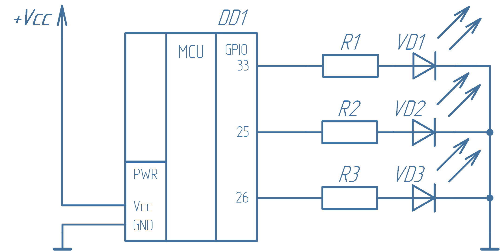
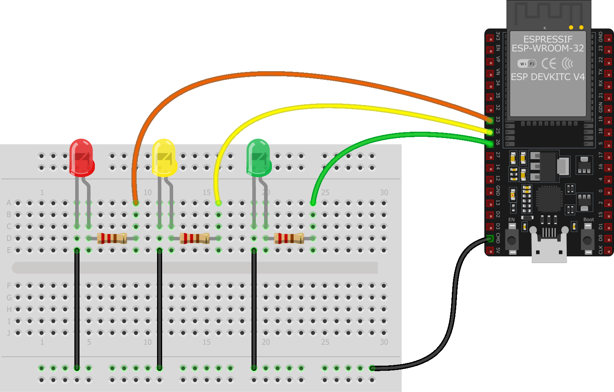
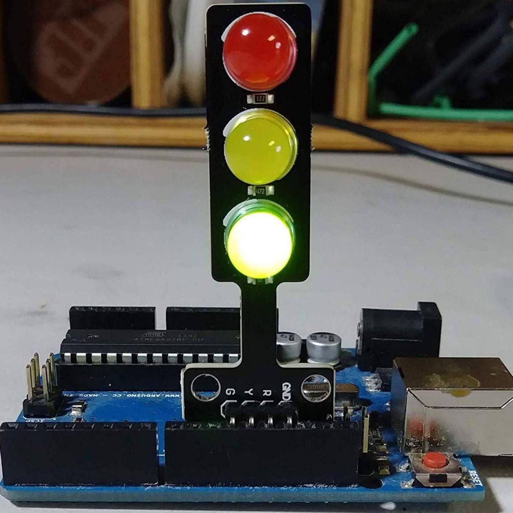

# 1.2 Лабораторная работа: входы и выходы микроконтроллера
## 1.2.1 Управление внешними светодиодами
### Цели работы
Научиться подключать модули (светодиоды: светофор - 3 светодиода и rgb светодиод) к плате ESP32. Научиться работать с ШИМ.

### 1.2.1.1. Светофор

В некоторых случаях одного светодиода на плате может оказаться мало. Допустим, мы хотим реализовать простой индикатор, имитирующий цвета светофора:  

- **Зелёный** – всё в порядке.  
- **Жёлтый** – какой-то параметр (например, измеряемая температура) приблизился к критическому значению и нужно предпринять шаги по нейтрализации надвигающейся угрозы.  
- **Красный** – критическая ситуация, требующая немедленного реагирования.  

В этом случае понадобится **три порта GPIO**, работающих на выход, к каждому из которых будет подключен светодиод.  

> ⚠️ Каждый светодиод должен подключаться через **токоограничивающий резистор**.  
> Необходимо учитывать максимальный ток выхода GPIO. Для большинства микроконтроллеров типовое максимальное значение тока составляет 20 мА (у ESP32 реальное значение выше).  
> Ток светодиода (`Iled`) обычно находится в диапазоне 2…20 мА.  

---

## Расчёт резистора для светодиода

Используем закон Ома:

R = (Uпит - Uled) / Iled
Где:  
- `Uпит = 3.3 В` — напряжение питания микроконтроллера  
- `Uled = 1.8…2.2 В` — прямое падение напряжения на светодиоде (берём среднее 2 В)  
- `Iled` — ток светодиода  

### Минимальное и максимальное сопротивление

- Для тока 20 мА:
  Rmin = (3.3 - 2.0) / 0.020 ≈ 65 Ом

- Для тока 2 мА:
  Rmax = (3.3 - 2.0) / 0.002 ≈ 650 Ом
  
Таким образом можем выбрать любое значение резисторов из диапазона 65…650 Ом. 
**Принципиальная схема**

**Размещение на макетной плате**


Если же мы используем какой-либо модуль, то они уже содержат токоограничивающий резистор (и дополнительный транзисторный ключ), так что их можно подключать напрямую. Для нашей задачи это могло бы выглядеть так.


Каждый порт GPIO, подключенный к светодиодам, можно было бы настроить (как в предыдущей программе) по-отдельности функцией gpio_set_direction(), но сделаем на этот раз по-другому. API ESP-IDF содержит функцию gpio_config(), которой нужно передать заполненную структуру gpio_config_t, в которой и укажем нужные порты GPIO и направление их работы.

Сама структура описана в файле driver\gpio.h следующим образом:
```c
typedef struct {
    uint64_t pin_bit_mask;
    gpio_mode_t mode;
    gpio_pullup_t pull_up_en;
    gpio_pulldown_t pull_down_en;
    gpio_int_type_t intr_type;
} gpio_config_t;
```
В этой структуре:
- `pin_bit_mask` – маска конфигурируемых портов GPIO  
- `mode` – режим работы (аналогично аргументу функции `gpio_set_direction()`)  
- `pull_up_en` – включение подтяжки Pull-Up  
- `pull_down_en` – включение подтяжки Pull-Down  
- `intr_type` – управление прерываниями

Программа, в которой будем управлять несколькими светодиодами будет следующая:

```c
#include <stdio.h>
#include "freertos/FreeRTOS.h"
#include "freertos/task.h"
#include "driver/gpio.h"

// пины подключения светодиодов
#define     LED_RED     33
#define     LED_YELLOW  25
#define     LED_GREEN   26
#define     GPIO_PINS   ((1ULL << LED_RED) | (1ULL << LED_YELLOW) | (1ULL << LED_GREEN))

void app_main(void)
{
    // объявление структуры конфигурации
    gpio_config_t io_conf = {};

    // задание необходимых свойств
    io_conf.pin_bit_mask = GPIO_PINS;             // порты
    io_conf.mode = GPIO_MODE_OUTPUT;              // режим работы - выход
    io_conf.pull_up_en = GPIO_PULLUP_DISABLE;     // нет подтягивающего резистора
    io_conf.pull_down_en = GPIO_PULLDOWN_DISABLE; // нет стягивающего резистора
    io_conf.intr_type = GPIO_INTR_DISABLE;        // прерывания отключены

    // установка конфигурации портов
    gpio_config(&io_conf);

    // счетчик итераций
    uint8_t ticks = 0;

    while (1)
    {
        switch(++ticks % 8)
        {
            case 0:
                gpio_set_level(LED_RED, 0);
                gpio_set_level(LED_YELLOW, 0);
                gpio_set_level(LED_GREEN, 0);
                break;
            case 1:
                gpio_set_level(LED_RED, 1);
                break;
            case 2:
                gpio_set_level(LED_YELLOW, 1);
                break;
            case 3:
                gpio_set_level(LED_RED, 0);
                break;
            case 4:
                gpio_set_level(LED_GREEN, 1);
                break;
            case 5:
                gpio_set_level(LED_YELLOW, 0);
                break;
            case 6:
                gpio_set_level(LED_RED, 1);
                break;
            case 7:
                gpio_set_level(LED_GREEN, 0);
                break;
        }
        vTaskDelay(200 / portTICK_PERIOD_MS);
    }
}
```
> [!TIP]
> **Задания**
>
> 1. Измените схему подключения и код программы так, чтобы они соответствовали вашему подключению модуля к плате.
> 2. В представленной программе один из светодиодов мигает не так, как остальные.  
>    Устраните это нарушение или реализуйте переключение по типу светофора.

### 1.2.1.2. Радуга
Прежде, чем приступать к "Радуге", разберем **ШИМ**

Широтно-импульсная модуляция, сокращенно ШИМ (англ. Pulse Width Modulation, PWM), является одним из наиболее распространенных методов управления мощностью в электронных системах. Этот метод позволяет регулировать мощность, подаваемую на нагрузку, путем изменения ширины импульсов постоянного тока. Широко используется в различных областях электроники, таких как управление двигателями, источники питания, освещение и многие другие устройства.

Основой принципа работы ШИМ является изменение длительности импульсов при постоянной частоте следования этих импульсов. Импульсы представляют собой прямоугольные волны, у которых длительность высокого уровня (включенного состояния) варьируется относительно общего периода сигнала.

ШИМ имеет три основных параметра: частоту, период и коэффициент заполнения. Частота ШИМ (измеряется в герцах) – это число раз, когда ШИМ-сигнал переходит с высокого уровня на низкий и обратно в течение одной секунды. Период ШИМ является величиной, обратной частоте ШИМ. 


Соотношение времени включения (`Ton`) к общему периоду (`T`), выраженное в процентах, называется **коэффициентом заполнения (Duty Cycle)** и может варьироваться от 0% до 100%:

D = (Ton / T) * 100%

В электронике для прямоугольных импульсов с переменной шириной чаще употребляется величина, обратная коэффициенту заполнения, называемая **скважностью**

S = T / Ton

Соответственно, коэффициент заполнения 50 % эквивалентен скважности, равной 2, 100 % – скважности, равной единице, а 0 % равносилен скважности, равной бесконечности (что имеет вполне логичную физическую интерпретацию, как полное отсутствие импульсов).

Если использовать ШИМ для управления светодиодом, то при низкой частоте ШИМ, например 0,5 Гц и коэффициенте заполнения 50 % (светодиод включается на 1 секунду, а затем выключается на 1 секунду) светодиод будет мигать. При увеличении частоты (уменьшении периода) будет достигнут критический порог, при котором человеческий глаз не сможет воспринимать мигание светодиода и будет казаться, что он горит в половину своей максимальной яркости. При изменении коэффициента заполнения будет меняться и яркость, так как будет меняться среднее напряжение, подводимое к светодиоду.

Среднее напряжение напрямую связано с коэффициентом заполнения ШИМ

Uсредн = UH * (D / 100%) + UL * (1 - D / 100%)
Где:  
- `UH` — напряжение в состоянии «включено»  
- `UL` — напряжение в состоянии «выключено»  
- `D` — коэффициент заполнения (%)
В ESP32 есть два периферийных устройства ШИМ: светодиодный ШИМ-контроллер (LEDC – LED Controller) и периферийное устройство управления двигателями на основе широтно-импульсной модуляции (MCPWM).

Основная цель светодиодного ШИМ-контроллера (как не трудно догадаться из названия) – управление яркостью светодиодов, хотя его также можно использовать для генерации ШИМ-сигналов и для других целей, например, для генерации звука. 

В ESP32 LEDC имеет две группы каналов (по 8 в каждой). Одна группа каналов работает в высокоскоростном режиме (high speed mode) и реализуется аппаратно. В этой группе каналов возможно автоматическое и постепенное увеличение или уменьшение скважности ШИМ, что позволяет управлять освещением без непосредственного задействования процессора. Другая группа каналов работает в низкоскоростном режиме (low speed mode). В этом режиме скважность ШИМ меняется программным драйвером. Каждая группа каналов может использовать разные источники тактирования ШИМ.

Настройка любого канала LEDC (как в высокоскоростном, так и низкоскоростном режиме) включает три шага:

1. Настройка таймера, путем указания частоты ШИМ-сигнала и разрешающей способности изменения его скважности.
2. Настройка канала путем связывания его с таймером и ножкой GPIO, на которую выводится ШИМ-сигнал. 
3. Настройка выходного сигнала ШИМ.

Настройка таймера осуществляется посредством вызова функции ledc_timer_config(), в которую необходимо передать заполненную структуру ledc_timer_config_t со следующими параметрами:

 - скоростной режим;
 - номер таймера;
 - источник тактирования;
 - частота ШИМ;
 - разрешающая способность коэффициента заполнения ШИМ.

Частота и разрешающая способность коэффициента заполнения ШИМ взаимозависимы. Чем выше частота ШИМ 𝑓𝑃𝑊𝑀, тем ниже доступное разрешение длительности рабочего цикла 𝑃𝑊𝑀_𝑟𝑒𝑠𝑜𝑙𝑢𝑡𝑖𝑜𝑛, и наоборот. Источник тактового сигнала также может ограничивать частоту ШИМ, и чем больше исходная частота тактового сигнала 𝑓𝑐𝑙𝑜𝑐𝑘, тем выше может быть задана максимальная частота ШИМ (в ESP32 максимальная частота тактовых импульсов может быть настроена на 80 МГц)

𝑓𝑃𝑊𝑀×2𝑃𝑊𝑀_𝑟𝑒𝑠𝑜𝑙𝑢𝑡𝑖𝑜𝑛≤𝑓𝑐𝑙𝑜𝑐𝑘
Где:  
- `fPWM` — частота ШИМ  
- `PWM_resolution` — разрядность коэффициента заполнения  
- `fclock` — частота тактового сигнала

После настройки таймера необходимо настроить требуемый канал, вызвав функцию `ledc_channel_config()`, в которую необходимо передать структуру `ledc_channel_config_t` с параметрами конфигурации канала. После этого канал начнет работать в соответствии с параметрами этой структуры и генерировать ШИМ-сигналы на выбранном GPIO с частотой, указанной при конфигурировании таймера, и коэффициентом заполнения, указанным при вызове этой функции.

Формирования ШИМ-сигнала можно приостановить в любое время, вызвав функцию `ledc_stop()`.

Изменить параметры ШИМ-сигнала можно несколькими способами. Во-первых, это вызов всё той же функции `ledc_channel_config()` с новыми параметрами канала. Во-вторых, так как LEDC предназначен всё же для диммирования светодиодов, можно просто изменять коэффициент заполнения для настроенного канала.

Чтобы задать коэффициент заполнения используется функция `ledc_set_duty()`, но чтобы изменения вступили в силу необходимо после этого вызвать `ledc_update_duty()`. Кстати, текущее значение коэффициента заполнения можно получить функцией `ledc_get_duty()`.

> ⚠️ **ВАЖНО**  
> Коэффициент заполнения, передаваемый функциям `ledc_set_duty()` и `ledc_update_duty()`, зависит от заданной **разрешающей способности** `duty_resolution`.  
> Его значение находится в диапазоне от `0` до `2^duty_resolution - 1`.  
> Например, если `duty_resolution = 10`, то возможные значения рабочего цикла будут от `0` до `1023`.  
> Если несколько каналов используют один и тот же таймер, **частота ШИМ и разрешающая способность** (число бит) этих каналов будут одинаковыми.
