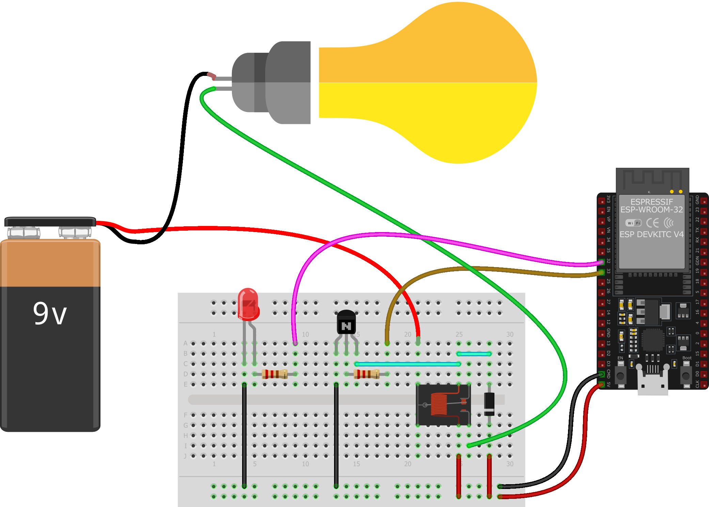

# 1.3 Практикум: Кодовый замок
### Цели работы
Подключить модули (реле, кнопка), поработать с клаввиатурой и на основе этих и ранее полученных навыком разработать код эмулирующий поведение кодового замка

## 1.3.1 Реле

Если нам необходимо управлять силовой нагрузкой, где сила тока превосходит максимально допустимый ток GPIO, либо напряжение выше, чем напряжение питания микроконтроллера, то понадобятся дополнительные ключевые элементы. И микроконтроллер будет управлять именно ими, а они, в свою очередь, – нагрузкой.

В основном используются транзисторные ключи, к которым в свою очередь могут подключаться другие элементы. Например, управляя внешними светодиодами в предыдущем практикуме, вы могли использовать светодиодные модули, в состав которых как раз входят такие ключи. Ключ может быть на биполярном или же полевом транзисторе. При использовании биполярных транзисторов чаще всего применяется NPN-транзистор, а для полевых – N-канальные. 

Также стоит учесть, что если нагрузка резистивная, то никаких особенностей подключения нет, а в случае индуктивной нагрузки понадобится защитный диод.

Подключение электромагнитного реле к контроллеру – это комбинация этих случаев. Типовое значение тока включения у реле – десятки и сотни миллиампер, и это значительно больше допустимого тока GPIO микроконтроллера, так что без транзисторного ключа не обойтись, а катушка реле – это индуктивность, соответственно, нужен диод.

При подаче напряжения на транзисторный ключ, транзистор открывается, через катушку реле начинает течь ток и возникает электромагнитное поле, которое притягивает к металлическому сердечнику катушки подвижный якорь, механически связанный с контактной группой, в результате происходит замыкание одних и размыкание других контактов. Своими контактами реле может коммутировать большие токи – десятки и сотни ампер.

Предположим, что нам надо коммутировать высоковольтную нагрузку. В этом случае как раз пригодится реле. В качестве полезной нагрузки может быть лампочка, а в качестве источника напряжения батарейка на 9 В. Аналогичным образом можно включить и лампу на ~220 В.

> [!CAUTION]
> ⚡ **Внимание!**
>
> Работа с высоким напряжением **опасна для жизни**.  
> На плате существуют области, прикосновение к которым приведёт к поражению электрическим током:  
> – винты контактных колодок,  
> – места пайки выводов контактных колодок и реле.  
>
> ❌ Не работайте с платой, если она подключена к бытовой сети.  
> ✅ Для готового устройства используйте **изолированный корпус**.  
>
> Если вы сомневаетесь, как подключить к реле электроприбор, работающий от сети 220 В,  
> или у вас есть малейшие сомнения — **остановитесь**: вы можете устроить пожар или подвергнуть себя смертельной опасности.

Схема для управления светодиодом и реле может выглядеть следующим образом


На макетной схеме это могло бы выглядеть так



А в случае использования модулей все опять было бы значительно проще


Но проверить базовую работоспособность реле, можно не подключая нагрузки. При изменении сигнала реле замыкает и размыкает контакты, создавая характерный щелчек. 
Программу напишем достаточно простую – будем мигать светодиодом с периодом 1 с и с периодом 10 с – будем переключать реле.

```c
#include "freertos/FreeRTOS.h"
#include "freertos/task.h"
#include "driver/gpio.h"

#define LED GPIO_NUM_2
#define RELAY GPIO_NUM_33

void app_main(void)
{
  gpio_set_direction(LED, GPIO_MODE_OUTPUT);
  gpio_set_direction(RELAY, GPIO_MODE_INPUT_OUTPUT);

  uint32_t ticks = 0;
  while (true)
  {
    gpio_set_level(LED, ticks % 2);
    if (ticks % 20 == 0)
      gpio_set_level(RELAY, !gpio_get_level(RELAY));
    
    ticks++;
    vTaskDelay(500 / portTICK_PERIOD_MS);
  }
}
```
> [!TIP]
> ** Задание **
> Напишите программу для данной схемы, чтобы реле переключалось 1 раз в 10 секунд, а светодиод переключался с частотой 1 Гц пока реле обесточено и 5 Гц, когда реле включено.

## 1.3.2 Button – считывание сигнала с кнопки
В рамках данного практикума рассмотрим самый простой, но не очень эффективный способ получения микроконтроллером сигналов из внешнего мира. Недостаток этого способа в том, что программа микроконтроллера постоянно опрашивает сигнал на входе GPIO, а это отнимает энергию, и в реальных проектах так делать не стоит. Особенно в IoT-проектах.

На нашей плате есть кнопка Boot, подключенная к GPIO0. Да, этот порт нужно использовать ограниченно, так как линия GPIO0 тесно связана с процедурой загрузки микроконтроллера – при сигнале логического нуля на этом порту, при включении питания, микроконтроллер ожидает поступления новой прошивки по последовательному порту. Но уже в рабочем режиме мы можем использовать этот порт и задействовать его в своей программе. Нужно только учитывать схемотехнику платы – порт GPIO0 имеет внешнюю подтяжку к плюсу питания резистором 10 кОм. И к нему же подключена кнопка, замыкающая в нажатом состоянии порт на землю.


Функцией `gpio_set_direction()` установим режим работы порта `GPIO_MODE_INPUT`.  
Функцией `gpio_set_pull_mode()` отключим внутренние подтягивающие резисторы (для гарантии), указав значение `GPIO_FLOATING`, так как у нас однозначно есть внешний резистор.  

Если бы резистора R1 в схеме выше не было, то этой функцией мы бы задали значение `GPIO_PULLUP_ONLY`.  

А вообще, возможны следующие варианты:  

| Режим                | Описание                   |
|-----------------------|----------------------------|
| `GPIO_PULLUP_ONLY`    | только pull-up             |
| `GPIO_PULLDOWN_ONLY`  | только pull-down           |
| `GPIO_PULLUP_PULLDOWN`| и pull-up и pull-down      |
| `GPIO_FLOATING`       | плавающий (нет подтяжки)   |

Будем считывать состояние кнопки, и в случае, когда она нажата, включать встроенный светодиод. Также будем прочитанное состояние выводить в терминал последовательного порта.

```c
#include <stdio.h>
#include "freertos/FreeRTOS.h"
#include "freertos/task.h"
#include "driver/gpio.h"

#define LED     GPIO_NUM_2
#define BUTTON  GPIO_NUM_0

void app_main(void)
{
  gpio_set_direction(LED, GPIO_MODE_OUTPUT);
  gpio_set_direction(BUTTON, GPIO_MODE_INPUT);
  gpio_set_pull_mode(BUTTON, GPIO_FLOATING);

  uint8_t button;
  while (1) {
    button = gpio_get_level(BUTTON);
    printf("GPIO state is %d\n", button);
    if(button)
      gpio_set_level(LED, 0);
    else
      gpio_set_level(LED, 1);

    vTaskDelay(100 / portTICK_PERIOD_MS);
  }
}
```

> [!TIP]
> **Задание для самостоятельной реализации**  
> Напишите программу для данной схемы, чтобы изначально светодиод мигал с частотой 1 Гц, а при нажатии кнопки – 5 Гц.

#№ 1.3.3 Практикум
### Цели работы
Пришло время обобщить знания, полученные в ходе лабораторных работ – самостоятельно решить задачу.

[!TIP]
Имеется помещение с дверью, закрытой на электронный замок. Этот замок открывается по введению кода на четырехкнопочной клавиатуре. Устройство должно обладать визуальной индикацией. Пока дверь закрыта, горит светодиод. После нажатия кнопки, дверь открывается и остается открытой в течение 10 секунд, все это время светодиод мигает. После чего дверь закрывается и светодиод опять светится непрерывно. Считаем, что код открытия двери устанавливается при изготовлении замка и никогда не меняется.
Для имитации замка, будем пользоваться реле.
