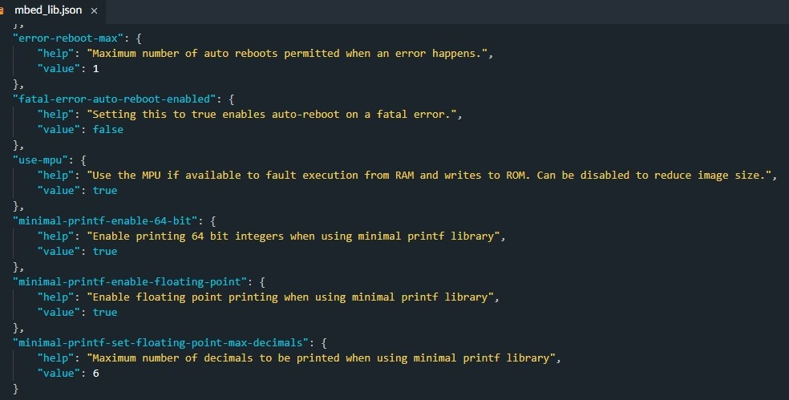

## 2.1. Лабораторная работа: знакомимся с сенсорами
### 2.1.1. АЦП – Аналогово-Цифровой Преобразователь
Особенностью аналоговых датчиков является то, что на их выходах генерируется непрерывный (аналоговый) сигнал, значение уровня которого является функцией времени. Этим аналоговый датчик и отличается от цифрового, где на выходе присутствует некоторая последовательность бит данных, кодирующих результаты измерения, и в самом минимальном варианте имеющих всего два значения 0 или 1.

Для обработки аналоговых величин в микроконтроллерах используется специальный модуль – АЦП (Аналогово-Цифровой Преобразователь).

ESP32 включает в себя два 12-битных АЦП последовательного приближения: АЦП1 (ADC1) и АЦП2 (ADC2), которые в совокупности поддерживают измерения на 20 каналах (аналоговые контакты). 

В силу того, что каждый канал АЦП имеет разрешение 12 бит, он может обнаружить 4096 (212) дискретных аналоговых уровней. Другими словами, он преобразует входные напряжения в диапазоне от 0 до 3,3 В (рабочее напряжение) в целочисленные значения в диапазоне от 0 до 4095. Это дает разрешение 3,3 вольта / 4096 единиц или 0,0008 вольта (0,8 мВ) на один отсчет АЦП. Более того, разрешение АЦП и диапазон каналов можно задать программно.

Строго говоря, максимальное входное напряжение АЦП по умолчанию составляет 1,1 В, но для считывания более высоких напряжений (вплоть до максимального напряжения питания 3,3 В), необходимо задать ослабление сигнала для выбранного канала АЦП.  Более того, в силу нелинейной характеристики АЦП у ESP32 наиболее точные измерения возможны в ограниченном диапазоне измерений (см. таблицу).

| Ослабление | Константа          | Допустимый диапазон (В) | Рабочий диапазон с наилучшей точностью (В) |
|------------|--------------------|-------------------------|-------------------------------------------|
| 0 дБ       | `ADC_ATTEN_DB_0`   | 0 … 1.1                 | 0.10 … 0.95                               |
| 2.5 дБ     | `ADC_ATTEN_DB_2_5` | 0 … 1.5                 | 0.10 … 1.25                               |
| 6 дБ       | `ADC_ATTEN_DB_6`   | 0 … 2.2                 | 0.15 … 1.75                               |
| 12 дБ      | `ADC_ATTEN_DB_12`  | 0 … 3.9                 | 0.15 … 2.45                               |

>[!WARNING]  
>Ограничения
>
>ADC2 может конфликтовать с Wi-Fi (при активном Wi-Fi чтения из ADC2 работают нестабильно или вообще недоступны). Лучше использовать ADC1 (GPIO1…GPIO10).
>GPIO 19, 20 часто используют для USB/JTAG, лучше избегать для АЦП, если не уверены.
>Не подавай >3.3 В на пин, иначе сгорит вход АЦП!
>Преобразователи АЦП на ESP32 нелинейны.

Блоки АЦП в ESP32 можно использовать в двух сценариях использования: получение результата однократного преобразования АЦП и получение результатов непрерывного преобразования АЦП. Конкретный блок АЦП в любой момент времени может работать только в одном режиме. В рамках этого практикума (и особенно без знаний и навыков работы с многопоточными приложениями) будем рассматривать именно первый вариант как наиболее простой – будем работать в режиме однократных преобразований.

В простейшем варианте работы с аналоговыми величинами будем получать отсчеты АЦП в режиме однократных измерений. Для этого сначала инициализируем работу с выбранным каналом АЦП вызовом функции `adc_oneshot_new_unit()`. Далее, функцией `adc_oneshot_config_channel()` настраиваем нужный канал АЦП, задавая в качестве параметра экземпляр структуры типа `adc_oneshot_chan_cfg_t`, где её параметры определяют входной диапазон напряжений и ослабление сигнала. А дальше постоянно осуществляем измерения вызовом функции `adc_oneshot_read()`. Полученные значения отсчетов АЦП будем выводить на экран.

Для расчета измеряемого напряжения на основе необработанных результатов АЦП можно использовать следующую формулу:

U_изм = U_max * D_изм / D_max

где:  
- `U_изм` – измеряемое напряжение  
- `U_max` – максимальное измеряемое входное напряжение аналогового входа (связано с ослаблением АЦП)  
- `D_изм` – число полученных отсчетов АЦП  
- `D_max` – максимальное число отсчетов АЦП заданной разрядности

```c
#include <stdio.h>
#include "freertos/FreeRTOS.h"
#include "freertos/task.h"
#include "esp_adc/adc_oneshot.h"

// Выбираем АЦП
#define ADC_UNIT                    ADC_UNIT_1
#define ADC_CHANNEL                 ADC_CHANNEL_4
#define ADC_ATTENUATION             ADC_ATTEN_DB_12

void app_main(void)
{
    static int adc_raw;

    // Инициализация АЦП
    adc_oneshot_unit_handle_t adc_handle;
    adc_oneshot_unit_init_cfg_t init_config = {
        .unit_id = ADC_UNIT,
    };
    ESP_ERROR_CHECK(adc_oneshot_new_unit(&init_config, &adc_handle));

    // Настройка АЦП
    adc_oneshot_chan_cfg_t config = {
        .bitwidth = ADC_BITWIDTH_DEFAULT,
        .atten = ADC_ATTENUATION,
    };
    ESP_ERROR_CHECK(adc_oneshot_config_channel(adc_handle, ADC_CHANNEL, &config));
    
    while (1)
    {
        // Чтение "сырых" данных
        ESP_ERROR_CHECK(adc_oneshot_read(adc_handle, ADC_CHANNEL, &adc_raw));
        printf("ADC%d Channel[%d] Raw Data: %d\n", ADC_UNIT + 1, ADC_CHANNEL, adc_raw);
        vTaskDelay(pdMS_TO_TICKS(1000));
    }

    // Никогда не будет выполнено, но удаляем всё, что создали
    ESP_ERROR_CHECK(adc_oneshot_del_unit(adc_handle));
}
```

### 2.1.1. Датчик света

Необходимое оборудование: Световой сенсор


Интерфейс подключения: Аналоговый

***Код программы:***

light_sensor.cpp:
```cpp
#include "mbed.h"

//AnalogIn - класс для считывания внешнего напряжения, приложенного к аналоговому входному выводу. 
//PA_1 - порт, к которому подключен световой сенсор
AnalogIn light_sensor(PA_1);

int main()
{
	float res;
	while (true) {
	
		//считывание светового сигнала
		res = light_sensor.read()*100; 
		printf("%2.2f\n",res);
		
		//сон за указанный период времени в мс
		thread_sleep_for(1000);
	}
}
```
***Результат работы программы:***


После запуска программы в консоль выводятся строки, показывающие уровень освещения в пределах от 0 до 100.
В данной лабораторной работе возникла проблема с выводом значений типа float. Для ее исправления необходимо зайти в файл mbed_lib.json и изменить в блоке «minimal-printf-enable-floating-point» значение «value» с false на true.



### 2.1.2. Акселерометр

Необходимое оборудование: отладочная плата акселерометра на основе ADXL345.


Интерфейс подключения: I2C
[Библиотека](https://os.mbed.com/users/peterswanson87/code/ADXL345_I2C/file/d9412b56f98a/ADXL345_I2C.h/)


***Код программы:***

accelerometer.cpp:
```cpp
#include "mbed.h"
#include "ADXL345_I2C.h"

ADXL345_I2C accelerometer(I2C_SDA,I2C_SCL); //I2C sda and scl

int main()
{
	int readings[3] = {0,0,0};
	printf("Starting ADXL345 text...\n");
	
	//Перейдите в режим ожидания, чтобы настроить устройство.
	accelerometer.setPowerControl(0x00);
	
	// Полное разрешение, +/- 16 г, 4 мг / младший бит.
	accelerometer.setDataFormatControl(0x0B);
	
	// Скорость передачи данных 3.2 кГц.
	accelerometer.setDataRate(ADXL345_3200HZ);
	
	// Режим измерения.
	accelerometer.setPowerControl(0x08);

	while(1){
		thread_sleep_for(1000);
		accelerometer.getOutput(readings);
		
		// 13-битные, знаковые расширенные значения.
		printf("%i, %i, %i\n",(int16_t)readings[0],(int16_t)readings[1],(int16_t)readings[2]);
	}
}
```
***Результат работы программы:***


После запуска программы в консоль выводятся строки, показывающие угол наклона акселерометра по трем осям по отношению к земной поверхности.

### 2.1.3. Дальномер

Необходимое оборудование: дальномер Grove Ultrasonic Ranger.


Интерфейс подключения: Аналоговый
[Библиотека](https://os.mbed.com/users/NickRyder/code/RangeFinder/)


***Код программы:***

range_finder.cpp:
```cpp
#include "mbed.h"
#include "RangeFinder.h"

//Указываем pio(PA_1), scale(10), pulsetime(5000), timeout(100000)
RangeFinder rf(PA_1,10,5000,100000);

int main()
{
	float d;
	while(1){
		d = rf.read_m();
		if(d == -1.0){ // если есть ошибки подключения
			printf("Timeout Error.\n");
		}else if(d > 5.0){ // если расстояние до объекта слишком большое
			printf("No objects within detection range.\n");
		}else{
			printf("Distance = %f m.\n",d);
		}
		thread_sleep_for(500);
	}
}
```
***Результат работы программы:***


После запуска программы в консоль выводятся строки, показывающие расстояние до объектов.
