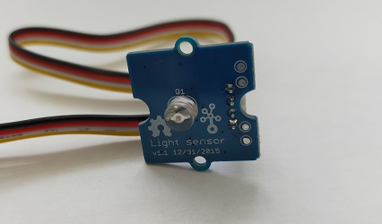
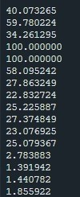
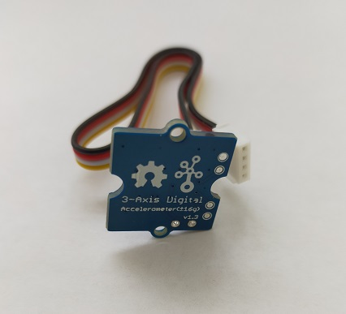
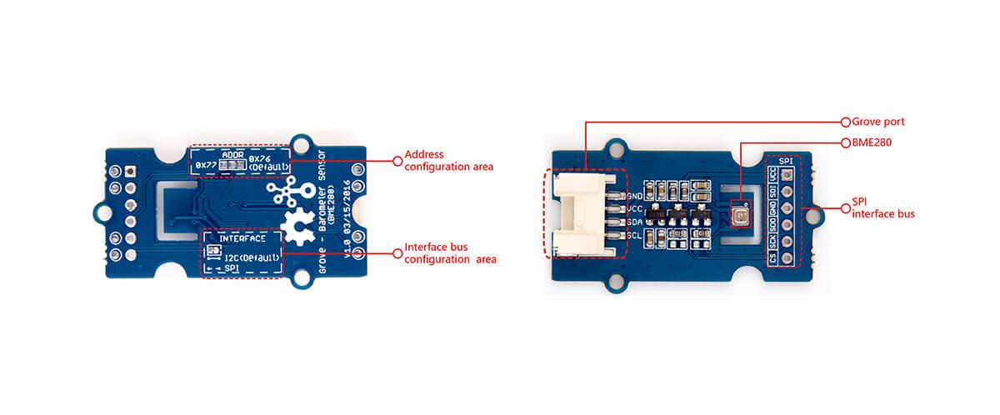
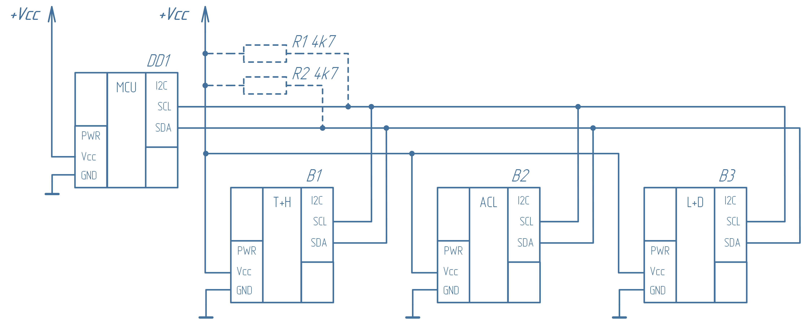
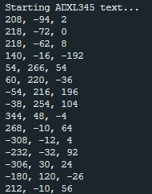
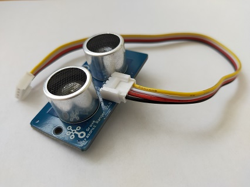
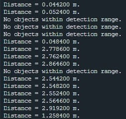

# 2. Лабораторная работа: Сенсоры и RTOS

## 2.1. Знакомимся с сенсорами
### 2.1.1. АЦП – Аналогово-Цифровой Преобразователь
Особенностью аналоговых датчиков является то, что на их выходах генерируется непрерывный (аналоговый) сигнал, значение уровня которого является функцией времени. Этим аналоговый датчик и отличается от цифрового, где на выходе присутствует некоторая последовательность бит данных, кодирующих результаты измерения, и в самом минимальном варианте имеющих всего два значения 0 или 1.

Для обработки аналоговых величин в микроконтроллерах используется специальный модуль – АЦП (Аналогово-Цифровой Преобразователь).

ESP32 включает в себя два 12-битных АЦП последовательного приближения: АЦП1 (ADC1) и АЦП2 (ADC2), которые в совокупности поддерживают измерения на 20 каналах (аналоговые контакты). 

В силу того, что каждый канал АЦП имеет разрешение 12 бит, он может обнаружить 4096 (212) дискретных аналоговых уровней. Другими словами, он преобразует входные напряжения в диапазоне от 0 до 3,3 В (рабочее напряжение) в целочисленные значения в диапазоне от 0 до 4095. Это дает разрешение 3,3 вольта / 4096 единиц или 0,0008 вольта (0,8 мВ) на один отсчет АЦП. Более того, разрешение АЦП и диапазон каналов можно задать программно.

Строго говоря, максимальное входное напряжение АЦП по умолчанию составляет 1,1 В, но для считывания более высоких напряжений (вплоть до максимального напряжения питания 3,3 В), необходимо задать ослабление сигнала для выбранного канала АЦП.  Более того, в силу нелинейной характеристики АЦП у ESP32 наиболее точные измерения возможны в ограниченном диапазоне измерений (см. таблицу).

| Ослабление | Константа          | Допустимый диапазон (В) | Рабочий диапазон с наилучшей точностью (В) |
|------------|--------------------|-------------------------|-------------------------------------------|
| 0 дБ       | `ADC_ATTEN_DB_0`   | 0 … 1.1                 | 0.10 … 0.95                               |
| 2.5 дБ     | `ADC_ATTEN_DB_2_5` | 0 … 1.5                 | 0.10 … 1.25                               |
| 6 дБ       | `ADC_ATTEN_DB_6`   | 0 … 2.2                 | 0.15 … 1.75                               |
| 12 дБ      | `ADC_ATTEN_DB_12`  | 0 … 3.9                 | 0.15 … 2.45                               |

> [!WARNING]  
> **Ограничения**:  
> - ADC2 может конфликтовать с Wi-Fi (при активном Wi-Fi чтения из ADC2 работают нестабильно или вообще недоступны). Лучше использовать ADC1 (GPIO1…GPIO10).  
> - GPIO 19, 20 часто используют для USB/JTAG, лучше избегать для АЦП, если не уверены.  
> - Не подавай >3.3 В на пин, иначе сгорит вход АЦП!  
> - Преобразователи АЦП на ESP32 нелинейны.

Блоки АЦП в ESP32 можно использовать в двух сценариях использования: получение результата однократного преобразования АЦП и получение результатов непрерывного преобразования АЦП. Конкретный блок АЦП в любой момент времени может работать только в одном режиме. В рамках этого практикума (и особенно без знаний и навыков работы с многопоточными приложениями) будем рассматривать именно первый вариант как наиболее простой – будем работать в режиме однократных преобразований.

В простейшем варианте работы с аналоговыми величинами будем получать отсчеты АЦП в режиме однократных измерений. Для этого сначала инициализируем работу с выбранным каналом АЦП вызовом функции `adc_oneshot_new_unit()`. Далее, функцией `adc_oneshot_config_channel()` настраиваем нужный канал АЦП, задавая в качестве параметра экземпляр структуры типа `adc_oneshot_chan_cfg_t`, где её параметры определяют входной диапазон напряжений и ослабление сигнала. А дальше постоянно осуществляем измерения вызовом функции `adc_oneshot_read()`. Полученные значения отсчетов АЦП будем выводить на экран.

Для расчета измеряемого напряжения на основе необработанных результатов АЦП можно использовать следующую формулу:

U_изм = U_max * D_изм / D_max

где:  
- `U_изм` – измеряемое напряжение  
- `U_max` – максимальное измеряемое входное напряжение аналогового входа (связано с ослаблением АЦП)  
- `D_изм` – число полученных отсчетов АЦП  
- `D_max` – максимальное число отсчетов АЦП заданной разрядности

```c
#include <stdio.h>
#include "freertos/FreeRTOS.h"
#include "freertos/task.h"
#include "esp_adc/adc_oneshot.h"

// Выбираем АЦП
#define ADC_UNIT                    ADC_UNIT_1
#define ADC_CHANNEL                 ADC_CHANNEL_4
#define ADC_ATTENUATION             ADC_ATTEN_DB_12

void app_main(void)
{
    static int adc_raw;

    // Инициализация АЦП
    adc_oneshot_unit_handle_t adc_handle;
    adc_oneshot_unit_init_cfg_t init_config = {
        .unit_id = ADC_UNIT,
    };
    ESP_ERROR_CHECK(adc_oneshot_new_unit(&init_config, &adc_handle));

    // Настройка АЦП
    adc_oneshot_chan_cfg_t config = {
        .bitwidth = ADC_BITWIDTH_DEFAULT,
        .atten = ADC_ATTENUATION,
    };
    ESP_ERROR_CHECK(adc_oneshot_config_channel(adc_handle, ADC_CHANNEL, &config));
    
    while (1)
    {
        // Чтение "сырых" данных
        ESP_ERROR_CHECK(adc_oneshot_read(adc_handle, ADC_CHANNEL, &adc_raw));
        printf("ADC%d Channel[%d] Raw Data: %d\n", ADC_UNIT + 1, ADC_CHANNEL, adc_raw);
        vTaskDelay(pdMS_TO_TICKS(1000));
    }

    // Никогда не будет выполнено, но удаляем всё, что создали
    ESP_ERROR_CHECK(adc_oneshot_del_unit(adc_handle));
}
```
>[!NOTE]  
> Обратите внимание, что в данном листинге представлен ещё один полезный приём, а именно использование макроса `ESP_ERROR_CHECK()`!  
> Во время работы программы важно контролировать, не возникло ли при вызове системных функций каких-либо ошибок.   
> Если какая-то ошибка всё же произошла, то, скорее всего, дальнейшее выполнение программы невозможно.  
> Макрос `ESP_ERROR_CHECK()` проверяет своё значение (типа `esp_err_t`), и если аргумент `ESP_ERROR_CHECK()` не равен `ESP_OK`, то в консоль печатается сообщение об ошибке и вызывается системная функция `abort()`, завершающая работу приложения.  

>[!TIP]  
> **Задание**  
> Добавьте в программу перевод отсчетов АЦП в величину измеряемого напряжения.  

### 2.1.2  Калиброванные значения АЦП

АЦП в ESP32 сравнивает входное аналоговое напряжение с опорным и определяет код результата. Считается, что опорное напряжение АЦП для ESP32 составляет 1100 мВ, однако истинное опорное напряжение может варьироваться от 1000 мВ до 1200 мВ среди различных чипов. Более того, зависимость количества отсчетов АЦП от измеряемого входного напряжения не является линейной.


Существует нижняя зона нечувствительности около 0,13 В, прежде чем АЦП начинает регистрировать значения, а свыше 2,5  В характеристика АЦП становится нелинейной. Очевидно, что АЦП ESP32 непригоден для использования ниже 0,13 В и неточен свыше 2,5 В. При этом в диапазоне измеряемых значений от 0,21 В до 2,53 В точность АЦП превышает 1%!

В целом такая характеристика может быть описана кусочно-линейными уравнениями и диапазон точных значений может быть расширен (от 0,14 В до 3,1 В).
Формула для расчёта напряжения:

U_изм = {
    0.0008 * D_изм + 0.1372,   если D_изм ≤ 3000  
    0.0005 * D_изм + 1.0874,   если D_изм > 3000
}

Чтобы минимизировать влияние различных опорных напряжений и обеспечить получение более точных выходных результатов может быть задействован драйвер калибровки АЦП (ADC Calibration Driver).

В самом простом случае этот драйвер обеспечивает задание необходимых углов наклона и смещений отрезков кусочно-линейного преобразования кодов АЦП в величину измеренного напряжения на основе данных, зашитых производителем микроконтроллера в его ПЗУ. В простых моделях ESP32 поддерживается только линейная схема калибровки, а в более сложных, например ESP32-C3 или ESP32-H2, значения измеряемого напряжения определяются на основе калибровочной кривой. Потенциально даже можно описать такую кривую самостоятельно на основе отдельной процедуры калибровки, обеспечив тем самым лучшие результаты преобразований АЦП.

Чтобы использовать драйвер калибровки, необходимо создать дескриптор схемы калибровки и вызвать функцию `adc_calibration_init()`.  
Затем вызов функции `adc_cali_raw_to_voltage()` обеспечит более точное преобразование необработанных данных АЦП в напряжение.

Приведём код для той же схемы, что была задействована в предыдущем практикуме:
```c
#include <stdio.h>
#include "freertos/FreeRTOS.h"
#include "freertos/task.h"
#include "esp_adc/adc_oneshot.h"
#include "esp_adc/adc_cali.h"
#include "esp_adc/adc_cali_scheme.h"

// Выбираем АЦП
#define ADC_UNIT                    ADC_UNIT_1
#define ADC_CHANNEL                 ADC_CHANNEL_4
#define ADC_ATTENUATION             ADC_ATTEN_DB_12

static bool adc_calibration_init(adc_unit_t unit, adc_channel_t channel, adc_atten_t atten, adc_cali_handle_t *out_handle);
static void adc_calibration_deinit(adc_cali_handle_t handle);

void app_main(void)
{
    static int adc_raw;
    static int voltage;

    // Инициализация АЦП
    adc_oneshot_unit_handle_t adc_handle;
    adc_oneshot_unit_init_cfg_t init_config = {
        .unit_id = ADC_UNIT,
    };
    ESP_ERROR_CHECK(adc_oneshot_new_unit(&init_config, &adc_handle));

    // Настройка АЦП
    adc_oneshot_chan_cfg_t config = {
        .bitwidth = ADC_BITWIDTH_DEFAULT,
        .atten = ADC_ATTENUATION,
    };
    ESP_ERROR_CHECK(adc_oneshot_config_channel(adc_handle, ADC_CHANNEL, &config));
    
    // Калибровка АЦП
    adc_cali_handle_t adc_calibration_handle = NULL;
    bool do_calibration = adc_calibration_init(ADC_UNIT, ADC_CHANNEL, ADC_ATTENUATION, &adc_calibration_handle);
    
    while (1) {
        // Чтение "сырых" данных
        ESP_ERROR_CHECK(adc_oneshot_read(adc_handle, ADC_CHANNEL, &adc_raw));
        printf("ADC%d Channel[%d] Raw Data: %d\n", ADC_UNIT + 1, ADC_CHANNEL, adc_raw);

        if (do_calibration) {
            // Если АЦП откалиброван, то вывести значение в милливольтах
            ESP_ERROR_CHECK(adc_cali_raw_to_voltage(adc_calibration_handle, adc_raw, &voltage));
            printf("ADC%d Channel[%d] Calibrated Voltage: %d mV\n", ADC_UNIT + 1, ADC_CHANNEL, voltage);
        }
        vTaskDelay(pdMS_TO_TICKS(1000));
    }

    // Никогда не будет выполнено, но удаляем всё, что создали
    ESP_ERROR_CHECK(adc_oneshot_del_unit(adc_handle));
    if (do_calibration) {
        adc_calibration_deinit(adc_calibration_handle);
    }
}

/*---------------------------------------------------------------
        Калибровка АЦП
---------------------------------------------------------------*/
static bool adc_calibration_init(adc_unit_t unit, adc_channel_t channel, adc_atten_t atten, adc_cali_handle_t *out_handle)
{
    adc_cali_handle_t handle = NULL;
    esp_err_t ret = ESP_FAIL;
    bool calibrated = false;

#if ADC_CALI_SCHEME_CURVE_FITTING_SUPPORTED
    if (!calibrated) {
        printf("Calibration scheme is \"Curve Fitting\"\n");
        adc_cali_curve_fitting_config_t cali_config = {
            .unit_id = unit,
            .chan = channel,
            .atten = atten,
            .bitwidth = ADC_BITWIDTH_DEFAULT,
        };
        ret = adc_cali_create_scheme_curve_fitting(&cali_config, &handle);
        if (ret == ESP_OK) {
            calibrated = true;
        }
    }
#endif
#if ADC_CALI_SCHEME_LINE_FITTING_SUPPORTED
    if (!calibrated) {
        printf("Calibration scheme is \"Line Fitting\"\n");
        adc_cali_line_fitting_config_t cali_config = {
            .unit_id = unit,
            .atten = atten,
            .bitwidth = ADC_BITWIDTH_DEFAULT,
        };
        ret = adc_cali_create_scheme_line_fitting(&cali_config, &handle);
        if (ret == ESP_OK) {
            calibrated = true;
        }
    }
#endif

    *out_handle = handle;
    if (ret == ESP_OK) {
        printf("Calibration Success\n");
    } else if (ret == ESP_ERR_NOT_SUPPORTED || !calibrated) {
        printf("eFuse not burnt, skip software calibration\n");
    } else {
        printf("Invalid arg or no memory\n");
    }

    return calibrated;
}

static void adc_calibration_deinit(adc_cali_handle_t handle)
{
#if ADC_CALI_SCHEME_CURVE_FITTING_SUPPORTED
    printf("deregister \"Curve Fitting\" calibration scheme\n");
    ESP_ERROR_CHECK(adc_cali_delete_scheme_curve_fitting(handle));

#elif ADC_CALI_SCHEME_LINE_FITTING_SUPPORTED
    printf("deregister \"Line Fitting\" calibration scheme\n");
    ESP_ERROR_CHECK(adc_cali_delete_scheme_line_fitting(handle));
#endif
}
```
> [!TIP]  
> **Задание**  
> Добавьте в программу перевод отсчетов АЦП в величину измеряемого напряжения на основе формул, представленных как в предыдущем, так и в этом практикуме, и сравните результаты.

### 2.1.3. Датчик света

Необходимое оборудование: Световой сенсор



Интерфейс подключения: Аналоговый

***Код программы:***

 Пример кода для датчика света (ESP32 + АЦП)

```c
## Пример кода для датчика освещённости (ESP32 + АЦП + калибровка)

```c
#include <stdio.h>
#include "freertos/FreeRTOS.h"
#include "freertos/task.h"
#include "esp_adc/adc_oneshot.h"
#include "esp_adc/adc_cali.h"
#include "esp_adc/adc_cali_scheme.h"

// Выбираем АЦП
#define ADC_UNIT                    ADC_UNIT_1
#define ADC_CHANNEL                 ADC_CHANNEL_4     // пример: GPIO32
#define ADC_ATTENUATION             ADC_ATTEN_DB_12   // до 3.3 В

static bool adc_calibration_init(adc_unit_t unit, adc_channel_t channel, adc_atten_t atten, adc_cali_handle_t *out_handle);
static void adc_calibration_deinit(adc_cali_handle_t handle);

void app_main(void)
{
    static int adc_raw;
    static int voltage;

    // Инициализация АЦП
    adc_oneshot_unit_handle_t adc_handle;
    adc_oneshot_unit_init_cfg_t init_config = {
        .unit_id = ADC_UNIT,
    };
    ESP_ERROR_CHECK(adc_oneshot_new_unit(&init_config, &adc_handle));

    // Настройка канала
    adc_oneshot_chan_cfg_t config = {
        .bitwidth = ADC_BITWIDTH_DEFAULT,
        .atten = ADC_ATTENUATION,
    };
    ESP_ERROR_CHECK(adc_oneshot_config_channel(adc_handle, ADC_CHANNEL, &config));
    
    // Калибровка
    adc_cali_handle_t adc_calibration_handle = NULL;
    bool do_calibration = adc_calibration_init(ADC_UNIT, ADC_CHANNEL, ADC_ATTENUATION, &adc_calibration_handle);
    
    while (1) {
        // Сырые данные
        ESP_ERROR_CHECK(adc_oneshot_read(adc_handle, ADC_CHANNEL, &adc_raw));
        printf("ADC%d Channel[%d] Raw Data: %d\n", ADC_UNIT + 1, ADC_CHANNEL, adc_raw);

        if (do_calibration) {
            ESP_ERROR_CHECK(adc_cali_raw_to_voltage(adc_calibration_handle, adc_raw, &voltage));
            printf("ADC%d Channel[%d] Voltage: %d mV\n", ADC_UNIT + 1, ADC_CHANNEL, voltage);

            // Уровень освещенности (условно 0–100%)
            int light_level = (voltage * 100) / 3300;
            printf("Light level: %d %%\n", light_level);
        }
        vTaskDelay(pdMS_TO_TICKS(1000));
    }

    // Очистка (никогда не выполнится в этом примере)
    ESP_ERROR_CHECK(adc_oneshot_del_unit(adc_handle));
    if (do_calibration) {
        adc_calibration_deinit(adc_calibration_handle);
    }
}
```
***Результат работы программы:***



После запуска программы в консоль выводятся строки, показывающие уровень освещения в пределах от 0 до 100.

### 2.1.4 Сканер I²C
В рамках данного практикума будем работать с компонентами устройств интернета вещей, которые соединяются между собой при помощи цифровых протоколов связи. Одним из самых популярных способов соединения чипов внутри устройства  является применение интерфейса последовательной синхронной связи I²C. При использовании такого интерфейса все устройства соединяются параллельно, а ведущее устройство может обмениваться данными с ведомыми по их адресам. Напомним, что такие адреса задаются производителем чипа, и в некоторых случаях в них можно изменить несколько бит, чтобы не возникало конфликтов на шине.

В нашем распоряжении есть несколько сенсоров с интерфейсом I²C, наприер:
- Акселерометр на основе ADXL345
- Датчик температуры, влажности и атмосферного давления BME280
Соединим все эти модули в шину.

  
  


Соединим все эти модули в шину.  

  

Микроконтроллер в нашей работе выступает в роли ведущего устройства (мастера), а датчики – ведомых (слейвов). Как вы помните, для того, чтобы контроллер мог с ними общаться, ему нужно знать адреса ведомых устройств. 

В нашей простой программе, листинг которой приводится далее, подключаем работу с драйвером шины I²C в режиме мастера, включив заголовочный файл `driver/i2c_master.h`. Далее, создаём ведущее устройство на шине I²C вызовом функции `i2c_new_master_bus()`, в которую передаём дескриптор создаваемого устройства и заполненную структуру типа `i2c_master_bus_config_t`, определяющую параметры работы шины, включая информацию о GPIO, использующихся для связи. В нашем случае `GPIO22` – это линия SCL, а `GPIO21` – линия SDA. 

При необходимости можно включить внутренние подтягивающие резисторы, но так как на используемых модулях они уже установлены, делать этого не будем. Затем в цикле перебираем все возможные 127 адресов ведомых устройств, и вызовом функции `i2c_master_probe()` пытаемся установить с ними соединение. Если таковое достигнуто, то выводим информацию об адресе обнаруженного на шине устройства. Если в течение 50 мс устройство с указанным адресом не отвечает, то пытаемся установить связь со следующим. 

По окончании цикла удаляем ведущее устройство шины функцией `i2c_del_master_bus()`, и программа завершает свою работу.

```c
#include <stdio.h>
#include "freertos/FreeRTOS.h"
#include "freertos/task.h"
#include "esp_err.h"
#include "driver/i2c_master.h"

#define I2C_TIMEOUT_VALUE_MS (50)

void app_main(void)
{
    i2c_master_bus_config_t i2c_mst_config = {
        .clk_source = I2C_CLK_SRC_DEFAULT,
        .i2c_port = I2C_NUM_0,
        .scl_io_num = GPIO_NUM_22,
        .sda_io_num = GPIO_NUM_21,
        .glitch_ignore_cnt = 7,
        .flags.enable_internal_pullup = false,
    };
    i2c_master_bus_handle_t bus_handle;
    ESP_ERROR_CHECK(i2c_new_master_bus(&i2c_mst_config, &bus_handle));

    printf("Scanning the bus...\r\n\r\n");
    uint8_t address;
    printf("     0  1  2  3  4  5  6  7  8  9  a  b  c  d  e  f\r\n");
    for (int i = 0; i < 128; i += 16)
    {
        printf("%02x: ", i);
        for (int j = 0; j < 16; j++)
        {
            fflush(stdout);
            address = i + j;
            esp_err_t ret = i2c_master_probe(bus_handle, address, I2C_TIMEOUT_VALUE_MS);
            if (ret == ESP_OK)
                printf("%02x ", address);
            else 
                if (ret == ESP_ERR_TIMEOUT)
                    printf("UU ");
                else
                    printf("-- ");
        }
        printf("\r\n");
    }
    i2c_del_master_bus(bus_handle);
}
```
> [!TIP]  
> **Задание**  
> Попеременно отключая и подключая модули датчиков, определите адреса ведомых устройств (они вам понадобятся в дальнейшем).  

### 2.1.4. Акселерометр

Необходимое оборудование: отладочная плата акселерометра на основе ADXL345.


Интерфейс подключения: I2C

***Код программы:***
Пример работы с ADXL345 через I²C (ESP32)

```c
#include <stdio.h>
#include <string.h>
#include "freertos/FreeRTOS.h"
#include "freertos/task.h"
#include "driver/i2c.h"
#include "esp_log.h"

#define I2C_MASTER_SCL_IO           22     // GPIO для SCL
#define I2C_MASTER_SDA_IO           21     // GPIO для SDA
#define I2C_MASTER_NUM              I2C_NUM_0
#define I2C_MASTER_FREQ_HZ          100000 // 100kHz
#define I2C_MASTER_TX_BUF_DISABLE   0
#define I2C_MASTER_RX_BUF_DISABLE   0

#define ADXL345_ADDR                0x53   // Адрес ADXL345 (SDO на GND)
#define ADXL345_REG_POWER_CTL       0x2D
#define ADXL345_REG_DATA_FORMAT     0x31
#define ADXL345_REG_DATAX0          0x32

static const char *TAG = "ADXL345";

// Инициализация I2C
esp_err_t i2c_master_init()
{
    i2c_config_t conf = {
        .mode = I2C_MODE_MASTER,
        .sda_io_num = I2C_MASTER_SDA_IO,
        .scl_io_num = I2C_MASTER_SCL_IO,
        .sda_pullup_en = GPIO_PULLUP_ENABLE,
        .scl_pullup_en = GPIO_PULLUP_ENABLE,
        .master.clk_speed = I2C_MASTER_FREQ_HZ,
    };
    esp_err_t err = i2c_param_config(I2C_MASTER_NUM, &conf);
    if (err != ESP_OK) return err;
    return i2c_driver_install(I2C_MASTER_NUM, conf.mode, I2C_MASTER_RX_BUF_DISABLE, I2C_MASTER_TX_BUF_DISABLE, 0);
}

// Запись одного байта в регистр ADXL345
esp_err_t adxl345_write_reg(uint8_t reg_addr, uint8_t data)
{
    i2c_cmd_handle_t cmd = i2c_cmd_link_create();
    esp_err_t err;

    i2c_master_start(cmd);
    i2c_master_write_byte(cmd, (ADXL345_ADDR << 1) | I2C_MASTER_WRITE, true);
    i2c_master_write_byte(cmd, reg_addr, true);
    i2c_master_write_byte(cmd, data, true);
    i2c_master_stop(cmd);

    err = i2c_master_cmd_begin(I2C_MASTER_NUM, cmd, pdMS_TO_TICKS(1000));
    i2c_cmd_link_delete(cmd);
    return err;
}

// Чтение нескольких байт из регистра ADXL345
esp_err_t adxl345_read_regs(uint8_t reg_addr, uint8_t *data, size_t len)
{
    i2c_cmd_handle_t cmd = i2c_cmd_link_create();
    esp_err_t err;

    // Отправляем адрес регистра
    i2c_master_start(cmd);
    i2c_master_write_byte(cmd, (ADXL345_ADDR << 1) | I2C_MASTER_WRITE, true);
    i2c_master_write_byte(cmd, reg_addr, true);

    // Запрос чтения
    i2c_master_start(cmd);
    i2c_master_write_byte(cmd, (ADXL345_ADDR << 1) | I2C_MASTER_READ, true);
    if (len > 1) {
        i2c_master_read(cmd, data, len - 1, I2C_MASTER_ACK);
    }
    i2c_master_read_byte(cmd, data + len - 1, I2C_MASTER_NACK);
    i2c_master_stop(cmd);

    err = i2c_master_cmd_begin(I2C_MASTER_NUM, cmd, pdMS_TO_TICKS(1000));
    i2c_cmd_link_delete(cmd);
    return err;
}

void app_main(void)
{
    esp_err_t err = i2c_master_init();
    if (err != ESP_OK) {
        ESP_LOGE(TAG, "I2C init failed: %s", esp_err_to_name(err));
        return;
    }
    ESP_LOGI(TAG, "I2C initialized");

    // Инициализация ADXL345
    err = adxl345_write_reg(ADXL345_REG_POWER_CTL, 0x08);  // Включаем измерения
    if (err != ESP_OK) {
        ESP_LOGE(TAG, "ADXL345 POWER_CTL write failed");
        return;
    }

    err = adxl345_write_reg(ADXL345_REG_DATA_FORMAT, 0x08); // FULL_RES, +-2g
    if (err != ESP_OK) {
        ESP_LOGE(TAG, "ADXL345 DATA_FORMAT write failed");
        return;
    }

    while (1) {
        uint8_t data[6];
        err = adxl345_read_regs(ADXL345_REG_DATAX0, data, 6);
        if (err == ESP_OK) {
            int16_t x = (int16_t)((data[1] << 8) | data[0]);
            int16_t y = (int16_t)((data[3] << 8) | data[2]);
            int16_t z = (int16_t)((data[5] << 8) | data[4]);

            ESP_LOGI(TAG, "Accel X: %d, Y: %d, Z: %d", x, y, z);
        } else {
            ESP_LOGE(TAG, "Error reading accelerometer data: %s", esp_err_to_name(err));
        }

        vTaskDelay(pdMS_TO_TICKS(500));
    }
}
```
***Результат работы программы:***



После запуска программы в консоль выводятся строки, показывающие угол наклона акселерометра по трем осям по отношению к земной поверхности.

### 2.1.5. Дальномер

Необходимое оборудование: дальномер Grove Ultrasonic Ranger.



Интерфейс подключения: Аналоговый

Принцип работы

1. **TRIG**: микроконтроллер подаёт короткий импульс (~10 µс) на вход TRIG датчика.  
2. Датчик посылает ультразвуковую волну.  
3. **ECHO**: датчик выдаёт длительный импульс, пропорциональный времени прохождения волны туда и обратно.  
4. **Расчёт расстояния**:  
\[
\text{distance\_cm} = \frac{\text{duration\_us}}{2 \cdot 29.1}
\]  

- `duration_us` — время в микросекундах между посылкой и приёмом эха.  
- Делим на 2, потому что сигнал проходит туда и обратно.  
- Результат выражается в сантиметрах.

***Код программы:***

```cpp
#include <stdio.h>
#include "freertos/FreeRTOS.h"
#include "freertos/task.h"
#include "driver/gpio.h"
#include "esp_log.h"

#define TRIG_GPIO 5
#define ECHO_GPIO 18

static const char *TAG = "HC-SR04";

void app_main(void)
{
    // Настройка GPIO
    gpio_reset_pin(TRIG_GPIO);
    gpio_set_direction(TRIG_GPIO, GPIO_MODE_OUTPUT);
    gpio_reset_pin(ECHO_GPIO);
    gpio_set_direction(ECHO_GPIO, GPIO_MODE_INPUT);

    while (1) {
        // Генерация импульса для TRIG
        gpio_set_level(TRIG_GPIO, 0);
        ets_delay_us(2);
        gpio_set_level(TRIG_GPIO, 1);
        ets_delay_us(10);
        gpio_set_level(TRIG_GPIO, 0);

        // Измерение длительности импульса на ECHO
        int64_t start = esp_timer_get_time();
        while (gpio_get_level(ECHO_GPIO) == 0);
        int64_t pulse_start = esp_timer_get_time();
        while (gpio_get_level(ECHO_GPIO) == 1);
        int64_t pulse_end = esp_timer_get_time();

        int64_t duration_us = pulse_end - pulse_start;
        float distance_cm = (duration_us / 2.0f) / 29.1f;

        ESP_LOGI(TAG, "Distance: %.2f cm", distance_cm);

        vTaskDelay(pdMS_TO_TICKS(500));
    }
}

```
***Результат работы программы:***



После запуска программы в консоль выводятся строки, показывающие расстояние до объектов.

### 2.1.5 4. Датчик температуры, влажности и атмосферного давления BME280

  


На этот раз будем получать данные с датчика температуры, давления и влажности воздуха BME280 по цифровой шине I²C. Любое ведомое I²C-устройство обладает множеством команд, пересылаемых на уровне интерфейса шины и обеспечивающих информационный обмен с ведущим устройством, но работать в таком режиме не очень удобно. Будем использовать высокоуровневый подход, тем более, что фреймворки ESP-IDF и ESP-IoT-Solution предоставляют такую возможность.
Добавим компоненты из фреймворка ESP-IoT-Solution, для этого откроем терминал () и в терминале введём команду: `idf.py add-dependency "espressif/bme280=*"` 
Теперь можно использовать код для работы с датчиком:

```c
#include <stdio.h>
#include "freertos/FreeRTOS.h"
#include "freertos/task.h"
#include "i2c_bus.h"
#include "bme280.h"

#define I2C_MASTER_SCL_IO   GPIO_NUM_22
#define I2C_MASTER_SDA_IO   GPIO_NUM_21
#define I2C_MASTER_FREQ_HZ  100000
#define I2C_BME280_ADDR     BME280_I2C_ADDRESS_DEFAULT

void app_main(void)
{
    i2c_config_t conf = {
        .mode = I2C_MODE_MASTER,
        .sda_io_num = I2C_MASTER_SDA_IO,
        .sda_pullup_en = GPIO_PULLUP_DISABLE,
        .scl_io_num = I2C_MASTER_SCL_IO,
        .scl_pullup_en = GPIO_PULLUP_DISABLE,
        .master.clk_speed = I2C_MASTER_FREQ_HZ,
    };
    i2c_bus_handle_t i2c_bus = i2c_bus_create(I2C_NUM_0, &conf);
    bme280_handle_t bme280 = bme280_create(i2c_bus, I2C_BME280_ADDR);

    printf("BME280 Test\n");
    bme280_default_init(bme280);

    float temperature = 0.0, humidity = 0.0, pressure = 0.0;
    while (1)
    {
        if (ESP_OK == bme280_read_temperature(bme280, &temperature)) {
            printf("Temperature: %f ", temperature);
        }
        if (ESP_OK == bme280_read_humidity(bme280, &humidity)) {
            printf("Humidity: %f ", humidity);
        }
        if (ESP_OK == bme280_read_pressure(bme280, &pressure)) {
            printf("Pressure: %f\n", pressure);
        }
        vTaskDelay(1000 / portTICK_PERIOD_MS);
    }

    bme280_delete(&bme280);
    i2c_bus_delete(&i2c_bus);
}
```
