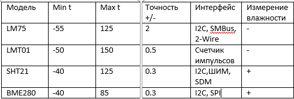

# РГР
## 2.2.1. Предисловие
Эта работа рекомендуется для самостоятельного выполнения. Мы будем работать с задачей "Мониторинг температуры и влажности на фармацевтическом складе" - реальной задачей из области IoT.

Задания содержат работу с требованиями заказчика, предполагается изучение требований и компонентов. Для их выполнения не требуется какого-либо оборудования, за исключением компьютера с выходом в Интернет. От вас потребуется поиск информации, выполнение набросков, анализ, аргументация своей позиции.

Дайте ответы на предложенные задания в письменном/печатном виде. По итогам выполнения заданий будет проведено общее обсуждение для того, чтобы совместно определить оптимальное решение.2.2.1. Предисловие
Эта работа рекомендуется для самостоятельного выполнения. Мы будем работать с задачей "Мониторинг температуры и влажности на фармацевтическом складе" - реальной задачей из области IoT.

Задания содержат работу с требованиями заказчика, предполагается изучение требований и компонентов. Для их выполнения не требуется какого-либо оборудования, за исключением компьютера с выходом в Интернет. От вас потребуется поиск информации, выполнение набросков, анализ, аргументация своей позиции.

Дайте ответы на предложенные задания в письменном/печатном виде. По итогам выполнения заданий будет проведено общее обсуждение для того, чтобы совместно определить оптимальное решение.

## 2.2.2. Изучение требований
Точные требования, которым должен удовлетворять склад, изложены в Приказе Минздравсоцразвития РФ от 23 августа 2010 г. N 706н "Об утверждении Правил хранения лекарственных средств". Пролистайте его текст.

Найдите в этом тексте один пункт и один абзац, которые интересны вам как разработчику. Выпишите подробности ТЗ, которые вы узнали из этого текста:
1.Минимальная частота снятия показаний датчика

 Минимальная частота снятия показаний датчика для системы мониторинга влажности и температуры на фармацевтическом складе, согласно требованиям закона 1 раз в день.

2.Срок хранения логов

 Минимальный срок хранения логов для системы мониторинга влажности и температуры на фармацевтическом складе, согласно требованиям закона 1 год.

3.Минимальная площадь склада

Минимальная площадь фармацевтического склада, согласно требованиям закона не менее 150 кв.м.
  
## 2.2.3. Сравнительный анализ датчиков.
Для решения задачи понадобятся датчики, измеряющие температуру и влажность. Датчик - это, как правило, компактное устройство со стандартным интерфейсом взаимодействия: I2C, UART или, самый простой вариант, GPIO.

Поскольку интерфейсы у датчиков разные, обычно датчик используется в паре с микроконтроллером, который собирает информацию с датчика, обрабатывает её (например, нормирует) и отправляет уже в унифицированной форме далее.

Вот примеры датчиков, которые доступны в продаже:

Внешний датчик температуры (-55…+125 ±3 °С) (на базе микросхемы LM75)

Внешний датчик температуры (-50…+150 ±0,7 °С) (на базе микросхемы LMT01)

Датчик температуры и влажности воздуха (на базе микросхемы SHT21)

Датчик температуры, влажности и давления воздуха (на базе микросхемы BME280)

Чтобы выбрать подходящий датчик для задачи, потребуется прочитать документацию на них. У разных датчиков - разные возможности и ограничения. Если есть цель заниматься IoT профессионально, то однократным изучением всего ассортимента обойтись не получится: инженер в области IoT должен пристально следить за новинками рынка.

Чтобы совершить обоснованный выбор датчика, выполните следующее задания:

## Таблица характеристик
Сравнительная таблица характеристик датчиков
Слева названия микросхем датчиков, а сверху - выбранные характеристики.

 ### Характеристики сходных датчиков. 

1.Датчик на базе микросхемы BME280 лучше всего подходит для системы мониторинга температуры и влажности на фармацевтическом складе. Из-за низкого энергопотребления, поскольку датчик должен долго работать без подзарядки и смены батареек.

2.Датчик на базе микросхемы LM01 подойдет, если будет нужно измерить температуры уха коровы, не заболела ли она. Датчик на длинном гибком проводе, его можно вплотную закрепить к коже.

3.Более точные датчики, как правило на базе микросхемы SHT21, погрешность измерения не превышает 0,3 нрадуса по Цельсию, такой датчик отлично подойдет для системы автоматического инкубатара для цеплят.

4.Датчик на базе микросхемы LM75 оказался самым дешевым, у данного датчика система энергопотребления выше.

Для каждой задачи, можно подобрать свой датчик.

    

