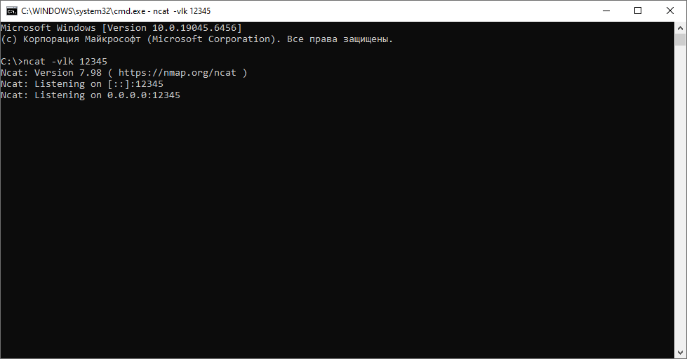
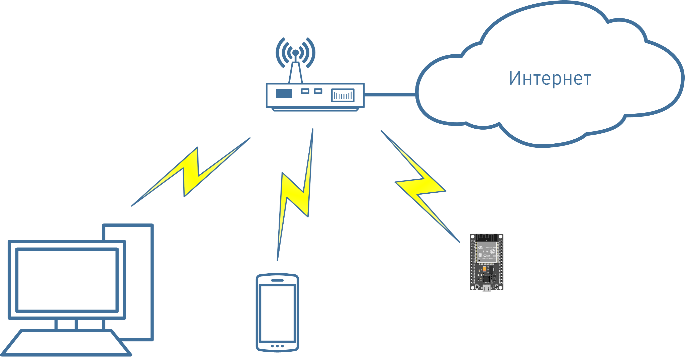
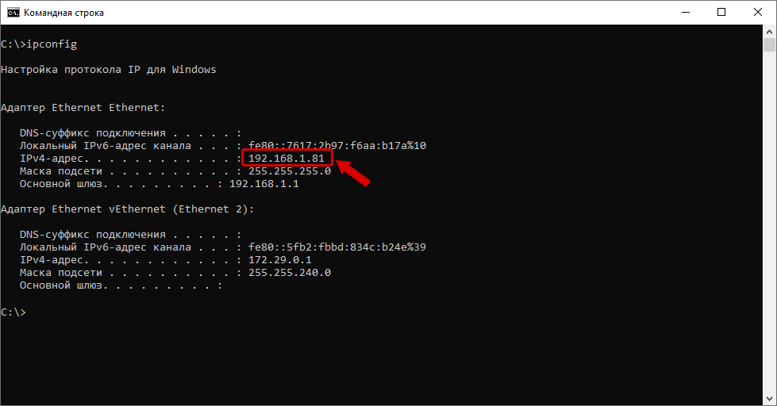

# Wi-Fi и передача данных на ESP32-S3 UNO

## Wi-Fi

Интернет вещей невозможно представить без сетевого взаимодействия. Даже простое IoT-устройство становится «умным», когда может передавать данные наружу или принимать команды извне. Выбор технологии связи влияет на архитектуру системы, её надёжность, энергопотребление и масштабируемость.

В IoT используются разные технологии связи:

  Показатель            LoRa   NB-IoT   BLE    Wi-Fi
  -------------------- ------ -------- ------ -------
  Работа без шлюза       --      --      --     \+
  Высокая скорость       --      --      --     \+
  Mesh-топология         \+      --      \+     \+
  Низкая стоимость      +/--     --     +/--    \+
  Безопасность           --      \+      \+     \+
  Дальность связи        \+      \+      --    +/--
  Распространённость     --      --      \+     \+

Wi-Fi имеет развитую инфраструктуру и доступен на ESP32 «из коробки», поэтому удобен для обучения и прототипирования. При этом его дальность ограничена, а энергопотребление сравнительно велико, поэтому для автономных IoT-устройств Wi-Fi подходит не всегда.

Wi-Fi --- технология беспроводной передачи данных по радиоканалу, основанная на стандартах семейства IEEE 802.11. Сам Wi-Fi не является Интернетом: он обеспечивает подключение устройства к локальной сети, а поверх него работают протоколы стека TCP/IP.

Типовая схема:

``` text
ESP32-S3 → Wi-Fi → роутер → локальная сеть / Интернет
```


Наиболее распространены диапазоны 2.4 и 5 ГГц. 2.4 ГГц обеспечивает большую дальность и лучше проходит через препятствия, поэтому часто используется в IoT. ESP32-S3 работает с Wi-Fi в диапазоне 2.4 ГГц.

Каждое Wi-Fi-устройство имеет MAC-адрес. После подключения к сети устройство обычно автоматически получает IP-адрес по DHCP. Этот IP-адрес может изменяться при повторных подключениях.

ESP32 поддерживает несколько режимов Wi-Fi:

1.  **STA (Station)** --- подключение к существующей Wi-Fi-сети.
    Основной режим для этой работы.
2.  **AP (Access Point)** --- ESP32 создаёт собственную точку доступа.
3.  **STA + AP** --- одновременная работа в обоих режимах.

В большинстве IoT-систем устройство само инициирует соединение с сервером.

------------------------------------------------------------------------

# Практическая часть 1. Подключение к Wi-Fi

В рамках работы подключим ESP32-S3 UNO к существующей точке доступа Wi-Fi. Точка доступа предоставит устройству IP-адрес по DHCP и обеспечит подключение к сети.

## Необходимо

-   ESP32-S3 UNO;
-   Wi-Fi-роутер или точка доступа смартфона;
-   SSID сети;
-   пароль Wi-Fi.

Использование смартфона в качестве точки доступа удобно для проверки обрывов связи и восстановления соединения.

Общая схема работы сетевого устройства:

1.  инициализация Wi-Fi;
2.  сканирование доступных сетей;
3.  подключение к выбранной сети;
4.  получение IP от DHCP;
5.  инициализация DNS;
6.  работа через TCP/UDP;
7.  переподключение при обрыве.

В ESP-IDF работа с Wi-Fi строится на событийной модели. Основные события:

-   запуск Wi-Fi в режиме STA;
-   успешное подключение к точке доступа;
-   потеря соединения;
-   получение IP-адреса по DHCP.

Нельзя считать соединение постоянным: приложение должно уметь ждать подключения и восстанавливать его после обрыва.

Wi-Fi-стек ESP-IDF использует NVS, поэтому перед запуском Wi-Fi необходимо вызвать `nvs_flash_init()`.

В исходном варианте практики состояние подключения отображалось светодиодом на `GPIO_NUM_2`. Для ESP32-S3 UNO индикация светодиодом здесь опущена, так как она не относится непосредственно к подключению Wi-Fi.

## Код подключения

``` c
#include <stdio.h>

#include "freertos/FreeRTOS.h"
#include "freertos/task.h"
#include "freertos/event_groups.h"

#include "esp_system.h"
#include "esp_wifi.h"
#include "esp_event.h"
#include "esp_netif.h"
#include "esp_log.h"
#include "nvs_flash.h"

#define WIFI_SSID "MY_WIFI_SSID"
#define WIFI_PASS "MY_WIFI_PASSWORD"

static EventGroupHandle_t wifi_event_group;
#define WIFI_CONNECTED_BIT BIT0

static void wifi_event_handler(
    void *arg,
    esp_event_base_t event_base,
    int32_t event_id,
    void *event_data
) {
    if (event_base == WIFI_EVENT &&
        event_id == WIFI_EVENT_STA_START) {

        esp_wifi_connect();

    } else if (event_base == WIFI_EVENT &&
               event_id == WIFI_EVENT_STA_DISCONNECTED) {

        xEventGroupClearBits(
            wifi_event_group,
            WIFI_CONNECTED_BIT
        );

        esp_wifi_connect();

    } else if (event_base == IP_EVENT &&
               event_id == IP_EVENT_STA_GOT_IP) {

        xEventGroupSetBits(
            wifi_event_group,
            WIFI_CONNECTED_BIT
        );
    }
}

static void wifi_task(void *pvParameter)
{
    esp_netif_ip_info_t ip_info;

    printf("Waiting for connection to the Wi-Fi network...\n");

    xEventGroupWaitBits(
        wifi_event_group,
        WIFI_CONNECTED_BIT,
        false,
        true,
        portMAX_DELAY
    );

    printf("Connected!\n");

    esp_netif_get_ip_info(
        esp_netif_get_handle_from_ifkey("WIFI_STA_DEF"),
        &ip_info
    );

    printf("IP Address:  " IPSTR "\n", IP2STR(&ip_info.ip));
    printf("Subnet mask: " IPSTR "\n", IP2STR(&ip_info.netmask));
    printf("Gateway:     " IPSTR "\n", IP2STR(&ip_info.gw));

    printf("You can connect now to any web servers!\n");

    while (1) {
        vTaskDelay(1000 / portTICK_PERIOD_MS);
    }
}

void app_main(void)
{
    printf("\nESP-IDF version used: %s\n", IDF_VER);

    esp_err_t ret = nvs_flash_init();

    if (ret == ESP_ERR_NVS_NO_FREE_PAGES ||
        ret == ESP_ERR_NVS_NEW_VERSION_FOUND) {

        ESP_ERROR_CHECK(nvs_flash_erase());
        ret = nvs_flash_init();
    }

    ESP_ERROR_CHECK(ret);

    ESP_ERROR_CHECK(esp_netif_init());
    ESP_ERROR_CHECK(esp_event_loop_create_default());

    esp_netif_create_default_wifi_sta();

    wifi_event_group = xEventGroupCreate();

    wifi_init_config_t wifi_init_config =
        WIFI_INIT_CONFIG_DEFAULT();

    ESP_ERROR_CHECK(
        esp_wifi_init(&wifi_init_config)
    );

    ESP_ERROR_CHECK(
        esp_event_handler_instance_register(
            WIFI_EVENT,
            ESP_EVENT_ANY_ID,
            &wifi_event_handler,
            NULL,
            NULL
        )
    );

    ESP_ERROR_CHECK(
        esp_event_handler_instance_register(
            IP_EVENT,
            IP_EVENT_STA_GOT_IP,
            &wifi_event_handler,
            NULL,
            NULL
        )
    );

    wifi_config_t wifi_config = {
        .sta = {
            .ssid = WIFI_SSID,
            .password = WIFI_PASS,
        },
    };

    ESP_ERROR_CHECK(
        esp_wifi_set_mode(WIFI_MODE_STA)
    );

    ESP_ERROR_CHECK(
        esp_wifi_set_config(
            WIFI_IF_STA,
            &wifi_config
        )
    );

    ESP_ERROR_CHECK(esp_wifi_start());

    printf("Connecting to %s\n", WIFI_SSID);

    xTaskCreate(
        &wifi_task,
        "wifi_task",
        2048,
        NULL,
        5,
        NULL
    );
}
```

## Выполнение

1.  Создайте новый проект ESP-IDF, например `wifi_connect`.
2.  Скопируйте листинг в `main.c`.
3.  Укажите свои `WIFI_SSID` и `WIFI_PASS`.
4.  Сохраните проект.
5.  Выполните компиляцию и загрузите прошивку.
6.  Убедитесь, что ESP32-S3 UNO подключается к сети и получает IP-адрес.

>[!TIP] ## Задание
>
>1.  Проверьте, что при обрыве связи устройство предпринимает попытки переподключения.
>2.  Добавьте счётчик числа подключений в обработчик событий.
>

------------------------------------------------------------------------

# Практическая часть 2. Передача данных

Предыдущий пример только подключает ESP32-S3 UNO к точке доступа. Теперь добавим передачу данных.

Wi-Fi обеспечивает подключение устройства к сети, а непосредственная доставка данных осуществляется протоколами транспортного уровня. Основные из них:

-   **TCP (Transmission Control Protocol)**;
-   **UDP (User Datagram Protocol)**.

Для сетевого взаимодействия ESP-IDF использует **LwIP (Lightweight IP)** --- стек TCP/IP для встраиваемых систем. LwIP предоставляет BSD-совместимый API сокетов.

Для TCP-клиента нам понадобятся:

``` c
socket()
connect()
send()
recv()
```

Сокет в TCP/IP связан с сетевым адресом и номером порта. Клиент инициирует подключение к серверу с помощью `connect()`, `send()` отвечает за отправку данных, а `recv()` --- за приём.

## Параметры сервера

Добавьте:

``` c
#include "lwip/sockets.h"
#include "lwip/netdb.h"
#include "esp_log.h"

#define SERVER_HOST "192.168.1.100"
#define SERVER_PORT 12345
```

Замените `192.168.1.100` на IP-адрес компьютера или другого устройства, на котором будет запущен TCP-сервер.

ESP32-S3 UNO и сервер должны находиться в одной сети либо между ними должна быть настроена маршрутизация.

## TCP-клиент

Добавьте к программе предыдущей части задачу:

``` c
static void socket_task(void *arg)
{
    char tx_buf[64];
    char rx_buf[128];

    for (;;) {

        xEventGroupWaitBits(
            wifi_event_group,
            WIFI_CONNECTED_BIT,
            pdFALSE,
            pdTRUE,
            portMAX_DELAY
        );

        ESP_LOGI("sock", "WiFi ready, creating socket");

        int sock = socket(
            AF_INET,
            SOCK_STREAM,
            IPPROTO_IP
        );

        if (sock < 0) {
            ESP_LOGE("sock", "Unable to create socket");
            vTaskDelay(pdMS_TO_TICKS(2000));
            continue;
        }

        struct sockaddr_in dest_addr = {
            .sin_family = AF_INET,
            .sin_port = htons(SERVER_PORT),
        };

        inet_pton(
            AF_INET,
            SERVER_HOST,
            &dest_addr.sin_addr
        );

        if (connect(
                sock,
                (struct sockaddr *)&dest_addr,
                sizeof(dest_addr)
            ) != 0) {

            ESP_LOGE("sock", "Socket connect failed");
            close(sock);
            vTaskDelay(pdMS_TO_TICKS(2000));
            continue;
        }

        ESP_LOGI("sock", "Socket connected");

        while (
            xEventGroupGetBits(wifi_event_group) &
            WIFI_CONNECTED_BIT
        ) {

            snprintf(
                tx_buf,
                sizeof(tx_buf),
                "Hello from ESP32\n"
            );

            int err = send(
                sock,
                tx_buf,
                strlen(tx_buf),
                0
            );

            if (err < 0) {
                ESP_LOGE("sock", "Send failed");
                break;
            }

            int len = recv(
                sock,
                rx_buf,
                sizeof(rx_buf) - 1,
                0
            );

            if (len < 0) {
                ESP_LOGE("sock", "Recv failed");
                break;

            } else if (len > 0) {

                rx_buf[len] = 0;
                ESP_LOGI(
                    "sock",
                    "Received: %s",
                    rx_buf
                );
            }

            vTaskDelay(pdMS_TO_TICKS(2000));
        }

        ESP_LOGW(
            "sock",
            "WiFi lost or socket error, closing socket"
        );

        close(sock);
    }
}
```

В `app_main()` добавьте создание задачи:

``` c
xTaskCreate(
    socket_task,
    "socket_task",
    4096,
    NULL,
    5,
    NULL
);
```

------------------------------------------------------------------------

## Узнаём IP-адрес компьютера

### Linux/macOS

``` bash
ifconfig
```

Для Linux также может быть доступна команда:

``` bash
hostname -I
```

### Windows

``` bash
ipconfig
```



Если отображается несколько IP-адресов, нужен адрес сетевого интерфейса, через который компьютер находится в одной сети с ESP32-S3 UNO.

Укажите найденный адрес в `SERVER_HOST`.

------------------------------------------------------------------------

## Запускаем TCP-сервер

Для проверки используем Ncat/Netcat.

В зависимости от установленной программы:

``` bash
nc -vlk 12345
```

или:

``` bash
ncat -vlk 12345
```



Будет запущен TCP-сервер, ожидающий подключения на порту `12345`.

После запуска ESP32-S3 UNO подключится к Wi-Fi, затем к TCP-серверу и передаст:

``` text
Hello from ESP32
```



### Вариант со смартфоном Android

В оригинальном материале также показаны варианты запуска TCP-сервера на Android.

**Netcat for Android**


**NetPal**


Если в консоли сервера ввести короткий текст и нажать Enter, он будет передан ESP32-S3 UNO и отображён в терминале платы.

------------------------------------------------------------------------

>[!TIP] ## Задание
>
>1.  Модифицируйте пример предыдущей части по предложенному алгоритму.
>2.  Проверьте передачу данных от IoT-устройства к серверу и обратно.
>3.  Подумайте, почему в примере упомянут «короткий текст» и насколько длинным он может быть.
