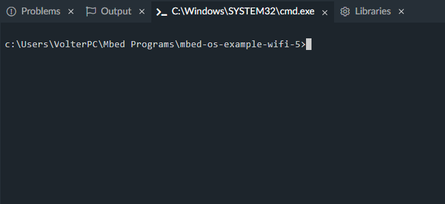
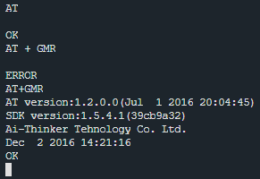

# 3.1 Лабораторная работа: Начинаем работу с Wi-Fi модулем
## Цель работы
Познакомится с WIFI модулем idw01m1, изучить способы обращения к модулю как к интерфейсу связи посредству работы с встроенными АТ командами. Получить первоначальные навыки работы с терминалом MBED. Получить необходимые навыки работы с платой для ее дальнейшей интеграцией с модулями платы и использованием в будущих проектах курса интернет вещей.
## 3.1.1 Необходимое оборудование
* Плата idw01m1


* Плата STM32Nucleo


* Провод USB для подключения

* Mbed studio для ввода команд

* Точка WIFI с доступом в интернет

### План лабораторной работы   

* Соединть idw01m1 с STM32Nucleo, проверить соединение

* Проверить актуальность прошивки, обновить при необходимости

## 3.1.2 Коммуникация через последовательный порт, AT команды
### Что ткое AT команды и для чего они нужны?
AT-команды — набор команд, разработанных в 1977 году компанией Hayes для собственной разработки, модема «Smartmodem 300 baud». Набор команд состоит из серий коротких текстовых строк, которые объединяют вместе, чтобы сформировать полные команды операций, таких как набор номера, начала соединения или изменения параметров подключения.

AT-команды обычно отправляются модему посредством коммуникационного программного обеспечения, но также могут быть введены пользователем вручную, с компьютерной клавиатуры.

АТ команды:

* можно вызывать вручную посредством обращения в терминал MBED

* вызываются автоматически когда мы запускаем программу для раюоты с интернет сетью(при старте программы АТ команды запускаются в библиотеке mbed.h)

При работе с платой idw01m1 команды AT проходят через уровни и драйверы HAL X-CUBE, вплоть до аппаратного обеспечения и через коммуникационный интерфейс UART/SPI к модулю SPWF01SA. Микропрограммное обеспечение модуля обрабатывает AT-команды, и результаты передаются обратно намикроконтроллер платформы через UART/SPI.

Документация для платы idw01m1 подробные сведения о пользовательских API.
(https://www.st.com/resource/en/user_manual/dm00241943-getting-started-with-the-xcubewifi1-wifi-functions-and-applications-software-expansion-for-stm32cube-stmicroelectronics.pdf)

### Работа с терминалом MBED

Рассмотрим пример с использованием АТ команд на примере платы ESP8266

Запускаеме терминал MBES Studio




Введите вначале команду AT - в ответ получите ответ OK. Если ошибетесь и введете несуществующую команду, плата выдаст ответ ERROR. Каждую команду завершайте следующими символами: возврат каретки (CTRL+M) и перенос строки (CTRL+J). Это те самые, которые в ASCII имеют коды \n и \r.

Ввод команды AT+GMR - информацию о плате. 



Синтаксис АТ команд на разных платах отличается, у каждой платы он уникален(см документацию по плате с которой производится работа)

Документация касательно платы idw01m1 и АТ командам для неё
(http://www.emcu.eu/wp-content/uploads/2016/11/en.stsw-idw002_wifi_training_v35.pdf)

Пример
------
Плата ESP8266 команда для подключиться к точке доступа

```C
AT+CWJAP="my-test-wifi","1234test".
```
Плата SPWF01SA11 команда для подключиться к точке доступа

```C
AT+S.SSIDTXT=my-test-wifi 
AT+S.SCFG=wifi_wpa_psk_text,1234test
```
------
Таблица команд для idw01m1


## 3.1.3. Обновление прошивки платы

Полезная информация по поводу платы расширения X-NUCLEO-IDW01M1 на основе WiFi модуля SWPF01SA(https://www.terraelectronica.ru/news/4715)

Самая новая версия прошивки - перейдите на сайт выбирите, Tools & Software и скачайте ее
(https://www.st.com/content/st_com/en/products/ecosystems/stm32-open-development-environment/stm32-nucleo-expansion-boards/stm32-ode-connect-hw/x-nucleo-idw01m1.html#tools-software). 

После установки перезагрузите компьютер.

## 3.1.4. Примеры AT-команд
Рассмотрим пример с использованием АТ команд на примере платы ESP8266

Команда AT+CWLAP выведет листинг имеющихся точек доступа:


Чтобы подключиться к точке доступа, используйте команду AT+CWJAP, передав в нее в качестве параметров название сети и пароль от нее (всё в кавычках):
```C
AT+CWJAP="my-test-wifi","1234test".
```
Если всё получится, то увидите следующее:


Теперь плата запомнила эту сеть и будет подключаться к ней каждый раз при старте.
------
Таблица команд для idw01m1


