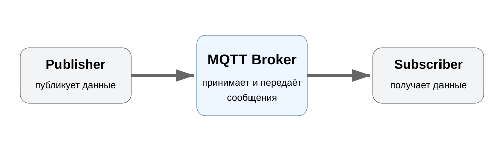
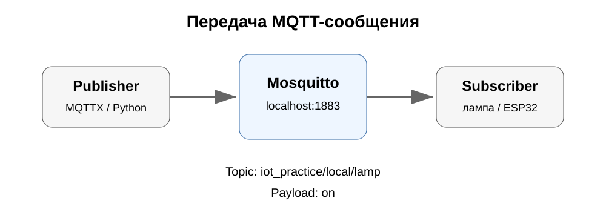
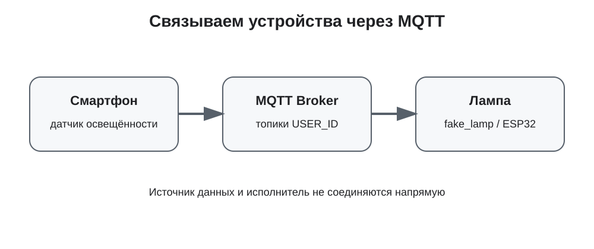
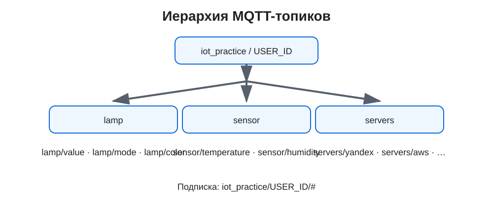

# MQTT и управление IoT-устройствами

В этой работе познакомимся с протоколом MQTT, настроим MQTT-клиенты, поуправляем виртуальной лампой, свяжем несколько устройств через брокер, напишем клиента на Python, а затем перенесём управление на ESP32.
---
## 1. Что такое MQTT
**MQTT (Message Queuing Telemetry Transport)** — лёгкий протокол обмена сообщениями, широко используемый в IoT. Он работает поверх TCP/IP и использует модель **Publish / Subscribe**.

Вместо прямого соединения устройств используется посредник — **MQTT Broker**:
- **Publisher** публикует данные;
- **Broker** принимает сообщения и передаёт их нужным клиентам;
- **Subscriber** подписывается на интересующие сообщения;
- **Topic** определяет, к какому каналу относится сообщение;
- **Payload** содержит сами данные.

Основные операции MQTT: `CONNECT`, `DISCONNECT`, `PUBLISH`, `SUBSCRIBE`, `UNSUBSCRIBE`.
Обычно MQTT использует порт `1883`. Для MQTT поверх TLS стандартно используется `8883`.
### Топики
Топики имеют иерархическую структуру. Уровни разделяются символом `/`.
```text
iot_practice/local/lamp
iot_practice/local/lamp/value
iot_practice/local/lamp/color
iot_practice/local/sensor/temperature
```

При подписке можно использовать wildcard:
| Символ | Значение | Пример |
|:---:|---|---|
| `+` | ровно один уровень | `iot_practice/+/lamp` |
| `#` | текущий уровень и все вложенные | `iot_practice/local/#` |
> [!WARNING]
> Wildcard применяется при **подписке**. Публикация выполняется в конкретный топик.
### QoS
MQTT предусматривает три уровня качества доставки:
| QoS | Смысл |
|:---:|---|
| `0` | сообщение отправляется без подтверждения |
| `1` | доставка подтверждается, возможны дубликаты |
| `2` | доставка контролируется дополнительным обменом сообщениями |
Чем выше QoS, тем больше служебного обмена.

### Retained message и Last Will

**Retained message** — сообщение, которое брокер сохраняет для топика. Новый подписчик может получить последнее сохранённое значение сразу после подписки.  
**Last Will and Testament (LWT)** позволяет заранее задать сообщение, которое брокер опубликует, если клиент неожиданно потеряет соединение.

---
## 2. Mosquitto: первый обмен сообщениями
**Mosquitto** — MQTT-брокер. Вместе с ним устанавливаются консольные MQTT-клиенты:
- `mosquitto_pub` — публикация сообщений;
- `mosquitto_sub` — подписка на сообщения.
### Установка на Windows
Скачайте и установите **Mosquitto for Windows**.
После установки Mosquitto обычно находится в каталоге:
```text
C:\Program Files\mosquitto
```
Откройте **PowerShell** или **Командную строку** и перейдите в каталог Mosquitto:
```powershell
cd "C:\Program Files\mosquitto"
```
Проверьте установку:
```powershell
.\mosquitto.exe -h
```
### Запуск локального MQTT-брокера
Запустите брокер:
```powershell
.\mosquitto.exe -v
```
По умолчанию Mosquitto использует порт `1883`.
> [!NOTE]
> Окно с запущенным брокером оставьте открытым.
### Подписка
Откройте второе окно PowerShell:
```powershell
cd "C:\Program Files\mosquitto"
.\mosquitto_sub.exe -h localhost -p 1883 -t "mytopic" -q 1
```
Теперь клиент ожидает сообщения, опубликованные в топике `mytopic`.
### Публикация
Откройте третье окно PowerShell:
```powershell
cd "C:\Program Files\mosquitto"
.\mosquitto_pub.exe -h localhost -p 1883 -t "mytopic" -m "Hello World" -q 1
```
В окне подписчика должно появиться:
```text
Hello World
```
Основные параметры:
| Параметр | Назначение |
|:---:|---|
| `-h` | адрес брокера |
| `-p` | порт |
| `-t` | топик |
| `-m` | сообщение |
| `-u` | имя пользователя |
| `-P` | пароль |
| `-q` | QoS |
| `-v` | вывод топика вместе с сообщением |
> [!TIP]
> ### Задание
>
> 1. Проверьте, чувствительны ли топики к регистру.
> 2. Проверьте поведение топиков со `/` в начале и конце.
> 3. Изучите ключ `-l`.
> 4. Проверьте retained-сообщение с ключом `-r`: опубликуйте его до подключения подписчика, затем подпишитесь.
> 5. Изучите Last Will and Testament с `--will-topic` и `--will-payload`.
---
## 3. MQTTX
Для дальнейших экспериментов удобнее использовать графический MQTT-клиент **MQTTX**.
Настройте соединение с локальным Mosquitto:
```text
Host:     mqtt://localhost
Port:     1883
Username: не требуется
Password: не требуется
SSL/TLS:  off
```
`Client ID` должен быть уникальным в пределах брокера. В MQTTX можно оставить автоматически сгенерированное значение.
Создайте подписку:
```text
iot_practice/local/#
```
Тип публикуемого сообщения установите **Plaintext**.
Для проверки опубликуйте:
```text
Topic:   iot_practice/local/test
Payload: Hello MQTT
```
Если подписка настроена правильно, сообщение появится у подписчика.  

---
## 4. Виртуальная умная лампа
`fake_lamp` — виртуальное IoT-устройство и одновременно MQTT-клиент. Оно подписывается на топики команд и изменяет своё состояние при получении сообщений.
Склонируйте проект:
```bash
git clone https://github.com/sic-rus-iot/fake_lamp
```
В `js/app.js` укажите локальный Mosquitto:
```javascript
var mqtt = {
    host: "localhost",
    useSSL: false,
    port: 1884,
    client: "local",
    username: "",
    password: "",
    topic_prefix: "iot_practice/"
};
```
Поскольку `fake_lamp` работает в браузере, ей требуется MQTT через **WebSocket**. Добавьте WebSocket listener в уже созданный `mosquitto-local.conf`:
```text
listener 1883
allow_anonymous true
listener 1884
protocol websockets
```
Перезапустите Mosquitto:
```powershell
cd "C:\Program Files\mosquitto"
.\mosquitto.exe -c mosquitto-local.conf -v
```
Обычные MQTT-клиенты используют порт `1883`, а `fake_lamp` — WebSocket-порт `1884`.
Откройте `index.html` в браузере. Через DevTools (`F12`) проверьте сообщение `connected`.
### Команды лампы
| Действие | Topic | Payload |
|---|---|---|
| включить | `iot_practice/local/lamp` | `on` |
| выключить | `iot_practice/local/lamp` | `off` |
| яркость | `iot_practice/local/lamp/value` | `0`–`100` |
| режим RGB | `iot_practice/local/lamp/mode` | `rgb` |
| режим диммера | `iot_practice/local/lamp/mode` | `dimmer` |
| цвет | `iot_practice/local/lamp/color` | RGBA или HEX |
Примеры цвета:
```text
rgba(255, 0, 0, 0)
rgba(0, 255, 0, 0)
rgba(0, 0, 255, 0)
#ab03caff
```
> [!WARNING]
> Не добавляйте в payload лишние пробелы и переводы строки.

> [!TIP]
> ### Задание
> Проверьте включение/выключение и изменение яркости лампы. Затем переключите её в режим `rgb` и отправьте несколько цветов.
---
## 5. Получаем данные с датчиков смартфона через MQTT
До этого мы вручную отправляли MQTT-сообщения. Теперь в качестве **Publisher** будем использовать смартфон.
**Sensor Spot** получает данные с датчиков Android и публикует их на MQTT-брокер. В этой работе используем **локальный Mosquitto на компьютере студента**, поэтому подключение к общему брокеру преподавателя не требуется.
```text
Смартфон
Lux Sensor → Sensor Spot
                │
                │ Wi-Fi / MQTT
                ▼
Компьютер
Mosquitto → mosquitto_sub
```
> [!IMPORTANT]
> Телефон и компьютер должны находиться в одной локальной сети Wi-Fi.
### 5.1. Узнаём IP-адрес компьютера
На телефоне нельзя указывать `localhost`: для смартфона `localhost` означает сам смартфон.
На Windows выполните:
```powershell
ipconfig
```
Найдите активный Wi-Fi-адаптер и строку **IPv4 Address**.
Например:
```text
IPv4 Address . . . . . . . . . . : 192.168.1.25
```
Этот адрес понадобится в Sensor Spot.
### 5.2. Разрешаем подключение телефона к Mosquitto
Используйте тот же `mosquitto-local.conf`, который был создан для локального брокера:
```text
listener 1883
allow_anonymous true
listener 1884
protocol websockets
```
Порт `1883` используется обычными MQTT-клиентами, а `1884` — браузерной `fake_lamp`.
Запустите Mosquitto с этой конфигурацией:
```powershell
cd "C:\Program Files\mosquitto"
.\mosquitto.exe -c mosquitto-local.conf -v
```
Если Windows Firewall запросит разрешение, разрешите доступ для **частной сети**.
> [!WARNING]
> `allow_anonymous true` используется только для учебного эксперимента в локальной сети. Для реальной системы MQTT необходимо настраивать аутентификацию и защищённое соединение.
### 5.3. Подписываемся на сообщения
Откройте второе окно PowerShell:
```powershell
cd "C:\Program Files\mosquitto"
.\mosquitto_sub.exe -h localhost -p 1883 -t "android/sensor/#" -v
```
Оставьте его открытым. Здесь будут отображаться сообщения, которые приходят на локальный брокер.
### 5.4. Настраиваем Sensor Spot
Запустите **Sensor Spot** на Android.
Сначала откройте вкладку:
```text
Sensors
```
Найдите **Lux Sensor** — датчик освещённости.
Затем перейдите:
```text
Settings
```
Укажите:
```text
Host: 192.168.1.25
Port: 1883
Topic: android/sensor
```
Вместо `192.168.1.25` укажите IPv4-адрес **своего компьютера**.
Включите:
```text
Dedicated topics → ON
Credentials      → OFF
```
**Dedicated topics** позволяет публиковать данные разных датчиков в отдельных MQTT-топиках.
### 5.5. Включаем датчик освещённости
Вернитесь во вкладку:
```text
Sensors
```
Найдите **Lux Sensor**/**Ambient Light Sensor** и включите его.
В зависимости от устройства и версии приложения субтопик может называться, например:
```text
sensor/light
```
или:
```text
sensor/physical_light
```
### 5.6. Начинаем публикацию
Перейдите на вкладку:
```text
Publish
```
и нажмите:
```text
CONNECT
```
При успешном подключении появится статус:
```text
CONNECTED
```
После этого в PowerShell с `mosquitto_sub` начнут появляться сообщения от смартфона.
Попробуйте:
- закрыть датчик рукой;
- оставить телефон при обычном комнатном освещении;
- направить на датчик фонарик.
Наблюдайте, как меняются данные.
### Что отправляет датчик освещённости
Sensor Spot публикует данные в формате JSON. Например:
```json
{
  "type": "android.sensor.light",
  "values": [40.55,43.912502,163.0,111.0,32.0,24.0,0.0,51.0,0.0,0.0,0.0,914.0,163.0,111.0,32.0,24.0],
  "timestamp": 194797928589553
}
```
Основные поля:
| Поле | Что содержит |
|---|---|
| `type` | тип Android-сенсора |
| `values` | данные, полученные от датчика |
| `timestamp` | временная метка измерения |
Значение:
```json
"type": "android.sensor.light"
```
означает, что сообщение получено от датчика освещённости.
### Значение освещённости
Для проверенного в этой работе датчика **STK33738 Ambient light sensor non-wakeup** на iQOO 12 значение освещённости соответствует первому элементу массива:
```text
values[0]
```
Например:
```json
"values": [40.55, *...*]
```
можно интерпретировать как:
```text
освещённость ≈ 40.55 lx
```
Экспериментальные данные показывают ожидаемое изменение:
```text
почти темно        → около 3 lx
комнатный свет     → десятки lx
яркий свет         → тысячи lx
очень яркий свет   → десятки тысяч lx
```
Остальные элементы массива содержат дополнительные данные, предоставляемые конкретным датчиком и его драйвером. Их структура может отличаться на других смартфонах.
> [!IMPORTANT]
> На другом смартфоне формат `values` может отличаться. Поэтому перед дальнейшей обработкой данных необходимо проверить, какое значение соответствует изменению освещённости.

> [!TIP]
> ### Задание
> 1. Запустите локальный Mosquitto.
> 2. Подключите Sensor Spot к IPv4-адресу своего компьютера.
> 3. Включите Lux Sensor.
> 4. Найдите MQTT-топик, в который Sensor Spot публикует его данные.
> 5. Получите сообщения при слабом, обычном и ярком освещении.
> 6. Сравните полученные JSON-сообщения.
> 7. Определите, как изменяется значение освещённости.
---
## 6. Панель управления MQTT на смартфоне
В предыдущей работе смартфон отправлял данные датчика освещённости на локальный Mosquitto:
```text
Sensor Spot → Mosquitto → mosquitto_sub
```
Теперь подключим к **тому же локальному брокеру** в приложении **IoT MQTT Panel**.
IoT MQTT Panel позволяет создать графический интерфейс поверх MQTT: переключатели, индикаторы, слайдеры и графики.
```text
Sensor Spot ──────────────┐
                          │
IoT MQTT Panel ───────► Mosquitto ◄────── mosquitto_sub
                       на ПК
```
### 6.1. Подключаем IoT MQTT Panel
Телефон и компьютер должны находиться в одной Wi-Fi-сети.
Создайте в **IoT MQTT Panel** новое MQTT-подключение и укажите:
```text
Broker: 192.168.1.25
Port:   1883
```
где `192.168.1.25` — IPv4-адрес вашего компьютера, определённый через:
```powershell
ipconfig
```
Логин и пароль не требуются, так как для учебного локального Mosquitto используется:
```text
allow_anonymous true
```
### 6.2. Проверяем подключение
На компьютере Mosquitto должен быть запущен с конфигурацией из предыдущей работы:
```powershell
cd "C:\Program Files\mosquitto"
.\mosquitto.exe -c mosquitto-local.conf -v
```
Для наблюдения за сообщениями откройте ещё одно окно PowerShell:
```powershell
cd "C:\Program Files\mosquitto"
.\mosquitto_sub.exe -h localhost -p 1883 -t "iot_practice/local/#" -v
```
### 6.3. Создаём элементы панели
Для управления лампой используем те же локальные топики, которые понадобятся дальше:
```text
iot_practice/local/lamp
iot_practice/local/lamp/value
```
### Switch
Добавьте **Switch** для включения и выключения лампы.
```text
Topic: iot_practice/local/lamp
ON  → on
OFF → off
```
При переключении панель будет публиковать:
```text
iot_practice/local/lamp on
```
или:
```text
iot_practice/local/lamp off
```
Пока физической или виртуальной лампы нет, эти команды можно наблюдать через `mosquitto_sub`.
### Slider
Добавьте **Slider** для управления яркостью:
```text
Topic: iot_practice/local/lamp/value
Min:   0
Max:   100
```
При перемещении ползунка приложение будет отправлять, например:
```text
iot_practice/local/lamp/value 25
iot_practice/local/lamp/value 50
iot_practice/local/lamp/value 100
```
### Данные Sensor Spot
IoT MQTT Panel может не только публиковать команды, но и подписываться на MQTT-топики.
При желании добавьте индикатор или график для топика, в который Sensor Spot отправляет данные датчика освещённости.
> [!NOTE]
> Sensor Spot отправляет JSON, поэтому возможность непосредственно отобразить `values[0]` зависит от возможностей выбранного элемента IoT MQTT Panel - требуется указать JsonPath, например - $.values[0]. На следующем этапе данные можно обработать программно.
### Что получилось
В локальной MQTT-системе одновременно работают несколько клиентов:
```text
Sensor Spot
    │
    │ данные датчика
    ▼
┌───────────────┐
│   Mosquitto   │
│ компьютер     │
└───────┬───────┘
        │
        ├────────► mosquitto_sub
        │
        └────────► IoT MQTT Panel
                    ▲
                    │ команды lamp / lamp/value
```
Sensor Spot в этой работе выступает преимущественно как **Publisher**.
IoT MQTT Panel может выполнять обе роли:
- **Publisher** — отправлять команды;
- **Subscriber** — получать и отображать MQTT-сообщения.
> [!TIP]
> ### Задание
> 1. Подключите IoT MQTT Panel к своему локальному Mosquitto.
> 2. Создайте Switch для `iot_practice/local/lamp`.
> 3. Создайте Slider для `iot_practice/local/lamp/value`.
> 4. Подпишитесь на компьютере на `iot_practice/local/#`.
> 5. Изменяйте Switch и Slider и наблюдайте сообщения в PowerShell.
> 6. Определите, какие клиенты в эксперименте являются Publisher, Subscriber или выполняют обе роли.
---
## 7. MQTT-клиент на Python
До этого сообщения отправлялись вручную. Теперь MQTT-клиент будет формировать и публиковать их программно.
Установите Paho MQTT:
```bash
pip install paho-mqtt
```
Пример клиента:
```python
import paho.mqtt.client as mqtt
def on_connect(client, userdata, flags, reason_code, properties):
    print("Connected:", reason_code)
def on_message(client, userdata, msg):
    print(msg.topic, msg.payload)
client = mqtt.Client(mqtt.CallbackAPIVersion.VERSION2)
client.on_connect = on_connect
client.on_message = on_message
client.connect("localhost", 1883)
client.subscribe("iot_practice/local/#")
client.loop_forever()
```
`subscribe()` задаёт интересующие клиента топики, а `on_message()` вызывается при получении сообщения.
Для публикации:
```python
client.publish(topic, payload)
```
> [!NOTE]
> Python-клиент подключается к локальному Mosquitto без логина и пароля.
### Генератор показаний

> [!TIP]
> ### Задание
> Напишите генератор, который примерно раз в 5 секунд публикует значения в:
> ```text
> iot_practice/local/sensor/temperature
> iot_practice/local/sensor/humidity
> iot_practice/local/sensor/luminosity
> ```
> Для задержки можно использовать `time.sleep()`, для генерации значений — `random`.
---
## 8. MQTT-клиент на ESP32
Теперь роль MQTT-клиента выполняет сам микроконтроллер.
Перед подключением к MQTT-брокеру ESP32 сначала подключается к Wi-Fi. По сравнению с предыдущей работой добавляются:
- параметры MQTT-брокера;
- MQTT-топики;
- обработчик событий MQTT;
- подписка на команды;
- очередь команд;
- управление нагрузкой через PWM.

Основные события:

| Событие | Назначение |
|---|---|
| `MQTT_EVENT_CONNECTED` | подключение к брокеру |
| `MQTT_EVENT_SUBSCRIBED` | подписка выполнена |
| `MQTT_EVENT_PUBLISHED` | сообщение опубликовано |
| `MQTT_EVENT_DATA` | получено сообщение |
| `MQTT_EVENT_DISCONNECTED` | соединение потеряно |

Начиная с ESP-IDF 6 MQTT-компонент подключается отдельно:
```bash
idf.py add-dependency "espressif/mqtt=*"
```
В коде:
```c
#include "mqtt_client.h"
```
Параметры:
```c
#define MQTT_BROKER_URL  "mqtt://192.168.1.25"
#define MQTT_BROKER_PORT 1883
#define MQTT_TOPIC_CMD   "iot_practice/local/lamp"
#define MQTT_TOPIC_VALUE "iot_practice/local/lamp/value"
```
После подключения Wi-Fi создаётся MQTT-клиент:
```c
esp_mqtt_client_config_t mqtt_cfg = {
    .broker.address.uri = MQTT_BROKER_URL,
    .broker.address.port = MQTT_BROKER_PORT,
};
esp_mqtt_client_handle_t client = esp_mqtt_client_init(&mqtt_cfg);
esp_mqtt_client_register_event(
    client,
    ESP_EVENT_ANY_ID,
    mqtt_event_handler,
    NULL
);
esp_mqtt_client_start(client);
```
При подключении к брокеру:
```c
esp_mqtt_client_subscribe(client, MQTT_TOPIC_CMD, 0);
esp_mqtt_client_subscribe(client, MQTT_TOPIC_VALUE, 0);
```
При `MQTT_EVENT_DATA` приложение разбирает сообщения:
```text
iot_practice/local/lamp       → on / off
iot_practice/local/lamp/value → 0..100
```
Далее команда передаётся через очередь задаче управления лампой, а яркость формируется ШИМ через LEDC.
> [!NOTE]
> В исходном примере используются GPIO конкретной ESP32 DevKit. Для **ESP32-S3 UNO** используйте выводы, к которым фактически подключены ваши светодиоды/модули. Номера GPIO из исходного примера переносить автоматически не нужно.

> [!TIP]
> ### Задание
> 1. Создайте проект `mqtt_lamp`.
> 2. Используйте код предыдущего Wi-Fi-проекта и добавьте MQTT-клиент.
> 3. Настройте Wi-Fi и укажите IPv4-адрес компьютера с локальным Mosquitto.
> 4. Реализуйте реакцию на `on`, `off` и изменение яркости.
> 5. Проверьте управление устройством через MQTTX.
---
## 9. Итоговое задание: физическая RGB-лампа
Виртуальная RGB-лампа была программной моделью устройства. Теперь требуется реализовать физический вариант.
### Сценарий
В бизнес-центре планируется адаптивное освещение:
- автоматическая регулировка освещения в зависимости от условий;
- включение нейтрального света в забронированной переговорной;
- тёплый свет в зонах отдыха;
- при пожаре — мигающий красный свет или динамическое указание пути эвакуации.
### Требования к светильнику
Разработайте устройство на ESP32, которое:
- реализует аддитивную модель RGB;
- позволяет управлять светильником по Wi-Fi;
- использует локальный MQTT-брокер Mosquitto на компьютере;
- совместимо с системой команд `fake_lamp`.
Подключите RGB-светодиод аналогично ранее выполненному проекту `rainbow`.
Для MQTT-клиента ESP32 задайте отдельный Client ID, например:
```text
esp32_lamp
```
Система команд должна поддерживать те же сущности:
```text
lamp
lamp/value
lamp/mode
lamp/color
```
> [!TIP]
> ### Результат
> Физическая RGB-лампа должна управляться теми же MQTT-командами, которые ранее использовались для `fake_lamp`.
---
## Источники и дополнительная информация
Основная структура практических заданий составлена по материалам курса Samsung Innovation Campus, предоставленным преподавателем.
Для краткого теоретического введения также использовано официальное описание MQTT:
- MQTT.org — https://mqtt.org/
- MQTT Specification — https://mqtt.org/mqtt-specification/
- MQTT FAQ — https://mqtt.org/faq/
