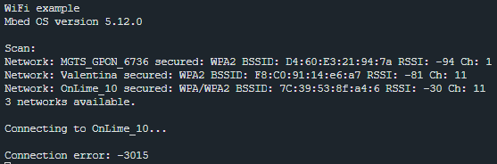
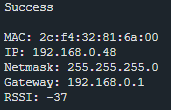

## 3.2. Лабораторная работа. Wi-Fi

### Цель работы

Требуется написать программу для связи платы с сетью wifi и получить данные сети.

### Ход выполнения работы

Сначала нужно открыть пример для Wifi в ESP-idf, 

В проекте задаются параметры подключения, такие как имя и пароль сети.
После запуска платы происходит следующее: вначале происходит сканирование и появляется список доступных сетей. Далее видим процесс подключения.

После подключения выводится сообщение о подключении.

